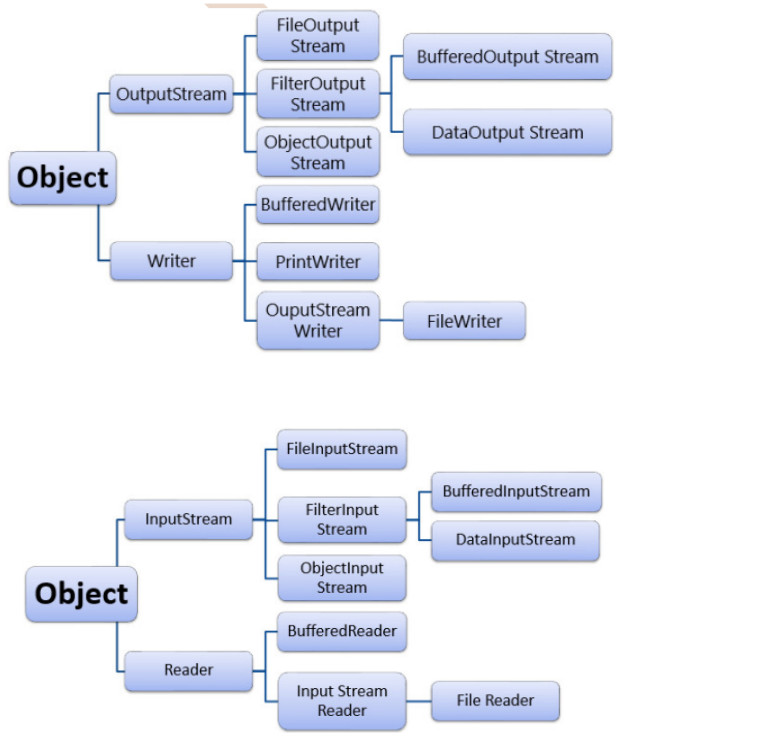
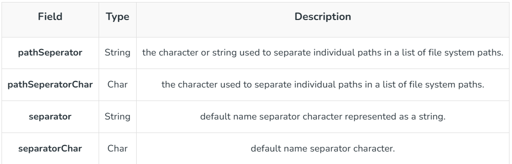
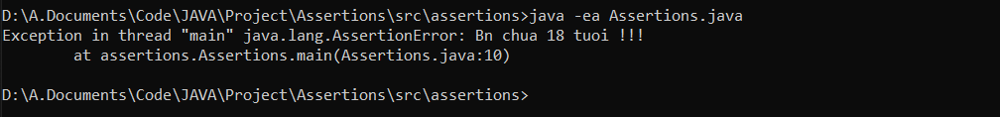
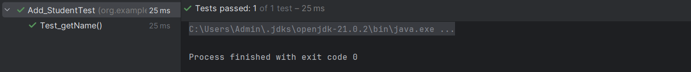
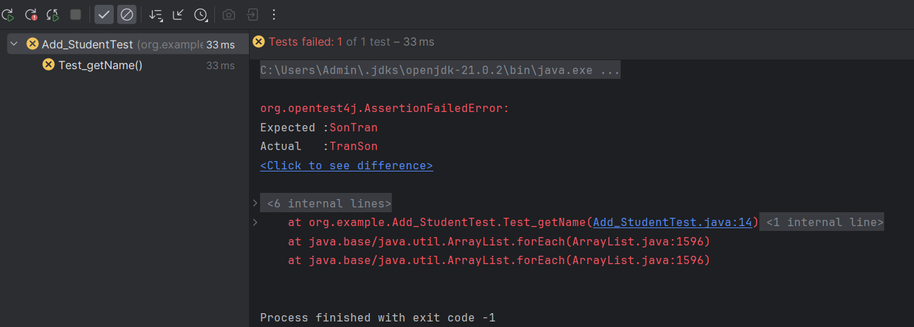

# [JAVA] - BUỔI 10: NHẬP XUẤT FILE, UNIT TEST
## I. File Handling trong Java.
### 1. Định nghĩa:

1. Trong Java, với sự trợ giúp của File Class, chúng ta có thể làm việc với các tệp. Lớp tệp này nằm trong gói java.io. Lớp File có thể được sử dụng bằng cách tạo một đối tượng của lớp và sau đó chỉ định tên của tệp.
2. Tại sao cần xử lý tệp?
- Xử lý tệp là một phần không thể thiếu của bất kỳ ngôn ngữ lập trình nào vì xử lý tệp cho phép ta lưu trữ đầu ra của bất kỳ chương trình cụ thể nào trong tệp và cho phép ta thực hiện một số thao tác nhất định trên đó.
- Nói một cách đơn giản, xử lý tệp có nghĩa là đọc và ghi dữ liệu vào một tệp.
3. Stream trong Java:
- Trong Java, một chuỗi dữ liệu được gọi là luồng.
- Khái niệm này được sử dụng để thực hiện các thao tác I/O trên một tệp.
    #### Có hai loại luồng:
    ##### 1. Input Stream:
    1. Lớp InputStream là lớp cha của tất cả các lớp đầu vào. Lớp đầu vào đc dùng để đọc dữ liệu từ nhiều nguồn khác nhau như bàn phím, mạng,... InputStream là một lớp trừu tượng và vì điều này, bản thân nó không hữu ích. Tuy nhiên, các lớp con của nó được sử dụng để đọc dữ liệu.
    2. Có một số lớp con của lớp InputStream, như sau:
       - AudioInputStream
       - ByteArrayInputStream
       - FileInputStream
       - FilterInputStream
       - StringBufferInputStream
       - ObjectInputStream
    3. Các phương thức của InputStream:
       1. read() – đọc một byte dữ liệu từ luồng đầu vào
       2. read(byte[] array) – đọc các byte từ luồng và lưu trữ trong mảng được chỉ định
       3. available() – trả về số byte có sẵn trong luồng đầu vào
       4. mark() – đánh dấu vị trí trong luồng đầu vào mà dữ liệu đã được đọc
       5. reset() – trả lại điều khiển đến điểm trong luồng nơi đánh dấu được đặt
       6. markSupported()- kiểm tra xem phương thức mark()và reset()có được hỗ trợ trong luồng không
       7.  skips() – bỏ qua và loại bỏ số byte được chỉ định khỏi luồng đầu vào
       8.  close() – đóng luồng đầu vào
    4.  VD:
    ##### 2. Output Stream:
    5.  Output Stream được sử dụng để ghi dữ liệu vào nhiều thiết bị đầu ra như màn hình, tệp, v.v. OutputStream là lớp cha trừu tượng đại diện cho một luồng đầu ra. OutputStream là một lớp trừu tượng và vì điều này, bản thân nó không hữu ích. Tuy nhiên, các lớp con của nó được sử dụng để ghi dữ liệu.
    6.  Có một số lớp con của lớp OutputStream như sau:
        - ByteArrayOutputStream
        - FileOutputStream
        - StringBufferOutputStream
        - ObjectOutputStream
        - DataOutputStream
        - PrintStream
    7. Các phương thức:
       - write() – ghi byte được chỉ định vào luồng đầu ra
       - write(byte[] array) – ghi các byte từ mảng được chỉ định vào luồng đầu ra
       - flush() – buộc phải ghi tất cả dữ liệu có trong luồng đầu ra đến đích
       - close() – đóng luồng đầu ra
    8. Có 2 loại Dữ liệu File trong Java
       1. Byte Stream: Sử dụng để đọc, ghi file dạng byte. Chia làm 2 loại:
          1. Byte OutputStream
          2. Byte InputStream
       2. Character Stream: Sử dụng để đọc, ghi file dạng kí tự. Chia làm 2 loại:
          1. Character OutputStream
          2. Character InputStream
### 2. File Class trong Java:
1. ĐN: 
   - File Class Java là biểu diễn của Java về tên đường dẫn tệp hoặc thư mục. Bởi vì tên tệp và thư mục có các định dạng khác nhau trên các nền tảng khác nhau, một chuỗi đơn giản là không đủ để đặt tên cho chúng. Lớp tệp Java chứa một số phương pháp để làm việc với tên đường dẫn, xóa và đổi tên tệp, tạo thư mục mới, liệt kê nội dung của thư mục và xác định một số thuộc tính phổ biến của tệp và thư mục.
     - Nó là một đại diện trừu tượng của các tập tin và tên đường dẫn thư mục.
     - Tên đường dẫn, dù trừu tượng hay ở dạng chuỗi có thể là tuyệt đối hoặc tương đối. Cha của một tên đường dẫn trừu tượng có thể thu được bằng cách gọi phương thức getParent() của lớp này.
     - Trước hết, chúng ta nên tạo đối tượng lớp File bằng cách truyền tên tệp hoặc tên thư mục cho nó. Hệ thống tệp có thể thực hiện các hạn chế đối với các hoạt động nhất định trên đối tượng hệ thống tệp thực tế, chẳng hạn như đọc, viết và thực thi. Những hạn chế này được gọi chung là quyền truy cập.
     - Các trường hợp của lớp File là bất biến; nghĩa là, một khi được tạo, tên đường dẫn trừu tượng được biểu thị bởi một đối tượng Tệp sẽ không bao giờ thay đổi.
2. Thao tác:
   1. Tạo 1 Object File: ```File a = new File("/usr/local/bin/geeks");```
      1. Lưu ý: 
         - ở Win, nhập file sẽ là: "\\" :```File a = new File("\\:C\\local\\bin\\geeks");```
         - Ở HDH khác: ```File a = new File("/:C/local/bin/geeks");```
   2.  Fields in File Class in Java : ???
       1.  
   3. Constructor: Có 4 kiểu khai báo: 
      1. File(File parent, String child);
      2. File(String pathname);
      3. File(String parent, String child);
      4. File(URL url);
      5. Trong đó: File parent là Object thư mục tk cha, String parent là đường dẫn dến thư mục tk cha, String child : trên thư mục muốn tạo, String pathname: Đường dẫn đến tệp muốn tạo, URL url: đường dẫn.
      6. VD: 
   4. Các phương thức:
        1.	**canExecute():	Kiểm tra xem ứng dụng có thể thực thi tệp được biểu thị bằng tên đường dẫn trừu tượng này hay không. => boolean.**
        2.	**canRead():	Kiểm tra xem ứng dụng có thể đọc tệp được biểu thị bằng tên đường dẫn trừu tượng này hay không.	=> boolean**
        3.	**canWrite():	Kiểm tra xem ứng dụng có thể sửa đổi tệp được biểu thị bằng tên đường dẫn trừu tượng này hay không.=> boolean**
        4.	compareTo(File pathname) :So sánh hai tên đường dẫn trừu tượng theo từ vựng. => int
        5.	**createNewFile(): Tạo ra một tệp trống mới, được đặt tên theo tên đường dẫn trừu tượng này. => boolean**
        6.	createTempFile(String prefix, String suffix): Tạo một tệp trống trong thư mục tệp tạm thời mặc định. => File
        7.	**delete(): Xóa tệp hoặc thư mục được biểu thị bằng tên đường dẫn trừu tượng này. => boolean**
        8.	equals(Object obj): Tests this abstract pathname for equality with the given object. => boolean
        9.	exists(): Kiểm tra tên đường dẫn trừu tượng này cho bằng với đối tượng đã cho. => boolean
        10.	**getAbsolutePath(): Trả về chuỗi tên đường dẫn tuyệt đối của tên đường dẫn trừu tượng này. => String**
        11.	list(): Trả về một mảng các chuỗi đặt tên cho các tệp và thư mục trong thư mục.	=> String[]
        12.	getFreeSpace(): Trả về số byte chưa được phân bổ trong phân vùng. => long
        13.	**getName(): Trả về tên của tệp hoặc thư mục được biểu thị bằng tên đường dẫn trừu tượng này. => String**
        14.	**getParent(): Trả về chuỗi tên đường dẫn thư mục cha của tên đường dẫn trừu tượng này. => String**
        15.	getParentFile(): Trả về File cha của tên đường dẫn trừu tượng này. => File
        16.	getPath(): Converts this abstract pathname into a pathname string. => String
        17.	setReadOnly(): Đánh dấu tệp hoặc thư mục đã đặt tên để chỉ cho phép các thao tác đọc. => boolean
        18.	**isDirectory(): Kiểm tra xem tệp được biểu thị bằng tên đường dẫn này có phải là một thư mục hay không. => boolean**
        19.	**isFile(): Kiểm tra xem tệp được biểu thị bằng tên đường dẫn trừu tượng này có phải là tệp bình thường hay không. => boolean**
        20.	isHidden(): Kiểm tra xem tệp được đặt tên bởi tên đường dẫn trừu tượng này có phải là tệp ẩn hay không.	boolean
        21.	length(): Trả về độ dài của tệp được biểu thị bằng tên đường dẫn trừu tượng này.	long
        22.	listFiles(): Trả về một mảng tên đường dẫn trừu tượng biểu thị các tệp trong thư mục.	File[]
        23.	**mkdir(): Tạo thư mục được đặt tên bởi tên đường dẫn trừu tượng này.	boolean**
        24.	**renameTo(File dest): Đổi tên tệp được biểu thị bằng tên đường dẫn trừu tượng này..	boolean**
        25.	setExecutable(boolean executable): Đặt quyền thực thi của chủ sở hữu.	boolean
        26.	setReadable(boolean readable): Đặt quyền đọc của chủ sở hữu.	boolean
        28.	setWritable(boolean writable): Để đặt quyền ghi của chủ sở hữu	boolean
        29.	toString(): Trả về chuỗi tên đường dẫn của tên đường dẫn trừu tượng này.	String
        30.	**toURI(): Xây dựng một URI tệp đại diện cho tên đường dẫn trừu tượng này.	URI**
    5. VD:
## II. Assertion
### 1. ĐN: 
- Khẳng định??? cho phép ta kiểm tra tính đúng đắn của bất kỳ giả định nào đã được đưa ra trong chương trình. Một khẳng định đạt được bằng cách sử dụng câu lệnh assert trong Java. Trong khi thực hiện khẳng định, nó được cho là đúng. Nếu nó không thành công, JVM sẽ ném một lỗi có tên AssertionError. Nó chủ yếu được sử dụng cho mục đích thử nghiệm trong quá trình phát triển.
### 2. Vì sao cần sử dụng?
1. Ưu điểm của Assertion
- Nhanh chóng và hiệu quả để phát hiện và sửa lỗi.
- Kiểm tra xác nhận chỉ được thực hiện trong quá trình phát triển và thử nghiệm. Chúng tự động bị xóa trong code release trong thời gian - chạy để không làm chậm quá trình thực thi chương trình.
- Nó giúp loại bỏ code viết sẵn và làm cho code dễ đọc hơn.
- Cơ cấu lại và tối ưu hóa mã với độ tin cậy cao hơn rằng nó hoạt động chính xác.
2. Khi nào nên sử dụng:
   1. Code không thể truy cập: 
### 3. Syntax:
1. Cú pháp khai báo:
   1. ```assert expression;```
   2. ```assert expression1 : expression2;```
2. Ví dụ:
   1. ```java
      // Java program to demonstrate syntax of assertion
      import java.util.Scanner;
      
      class Test {
         public static void main(String args[])
         {
            int value = 15;
            assert value >= 20 : " Underweight";
            System.out.println("value is " + value);
         }
      }
      output:  Ko bật xác nhận: 15
               Có bật xác nhận: Exception in thread "main" java.lang.AssertionError: Underweight
      ``` 
3. Kích hoạt xác nhận:
   1. Theo mặc định, xác nhận bị đóng. 
   2. Bật xác nhận(Assertion) cho các lớp và gói cụ thể
   3. Nếu chúng ta không cung cấp bất kỳ đối số nào cho các công tắc dòng lệnh khẳng định : ```java -ea```
      - Điều này cho phép xác nhận(Assertion) trong tất cả các lớp ngoại trừ các lớp hệ thống.

   4. Chúng ta cũng có thể kích hoạt xác nhận(Assertion) cho các lớp và gói cụ thể bằng cách sử dụng các đối số. Các đối số có thể được cung cấp cho các công tắc dòng lệnh này là:

      1. Bật xác nhận(Assertion) trong tên lớp
         - Để kích hoạt xác nhận(Assertion) cho tất cả các lớp của chương trình Chính của chúng ta: ```java -ea Main```
         - Để bật một lớp: ```java -ea:AnimalClass Main```
           - Điều này cho phép xác nhận(Assertion) chỉ AnimalClass trong Main của chương trình.

      2. Bật xác nhận(Assertion) trong tên gói
         - Để chỉ bật xác nhận(Assertion) cho gói com.animal và các gói con của nó. ```java -ea:com.animal... Main```
         - Bật xác nhận(Assertion) trong các gói không có tên
           - Để kích hoạt xác nhận(Assertion) trong các gói không có tên (khi chúng ta không sử dụng câu lệnh gói) trong thư mục làm việc hiện tại. ```java -ea:... Main```
      - Bật xác nhận(Assertion) trong các lớp hệ thống
        - Để kích hoạt xác nhận(Assertion) trong các lớp hệ thống, chúng ta sử dụng một công tắc dòng lệnh khác: ```java -esa:arguments```  HOẶC LÀ ```java -enablesystemassertions:arguments```
        - Các đối số có thể được cung cấp cho các dòng này là giống nhau.
4. Tắt xác nhận :
   - Để tắt xác nhận(Assertion), chúng ta sử dụng: ```java -da arguments ``` HOẶC LÀ ```java -disableassertions arguments```
   - Để tắt xác nhận(Assertion) trong các lớp hệ thống, chúng ta sử dụng: ```java -dsa:arguments``` HOẶC LÀ ```java -disablesystemassertions:arguments```
   - Các đối số có thể được truyền trong khi tắt xác nhận(Assertion) cũng giống như khi bật chúng.
5. VD:
   ```java
   package assertions;
   public class Assertions {
      public static void main(String args[])
      {
         int age = 11;
         assert age >= 18 : "Bn chua 18 tuoi !!!";
         System.out.println("AGE is " + age);
      }

   }
   ```

- KQ:
6. SS Khẳng định và Xử lý ngoại lệ:
   1. Khẳng định chủ yếu được sử dụng để kiểm tra các tình huống bất khả thi về mặt logic. Ví dụ: chúng có thể được sử dụng để kiểm tra trạng thái mà mã mong đợi trước khi bắt đầu chạy hoặc trạng thái sau khi chạy xong. Không giống như xử lý ngoại lệ/lỗi thông thường, xác nhận thường bị vô hiệu hóa trong thời gian chạy.


## III. Unit Test
1. Unit Testing là gì?
- Unit Testing liên quan đến việc kiểm tra từng thành phần trong mã của bạn để xem chúng có hoạt động như mong đợi hay không. Nó cô lập từng phương thức riêng lẻ của mã của bạn và thực hiện các bài kiểm tra trên đó. Unit Testing giúp đảm bảo rằng phần mềm của bạn đang hoạt động như mong đợi trước khi phát hành.
- Là một nhà phát triển, bạn sẽ viết các Unit Testing ngay sau khi bạn viết xong một đoạn mã. Bây giờ, bạn có thể hỏi, đó không phải là công việc của một tester? Theo một cách nào đó, có, một tester chịu trách nhiệm kiểm tra phần mềm. Tuy nhiên, việc bao quát từng dòng mã sẽ gây thêm nhiều áp lực cho người kiểm tra. Vì vậy, đó là một thực tiễn tốt nhất cho các nhà phát triển để viết thử nghiệm cho mã của riêng họ.
- Mục tiêu của unit testing là đảm bảo rằng bất kỳ chức năng mới nào không phá vỡ chức năng hiện có. Nó cũng giúp xác định bất kỳ vấn đề hoặc lỗi nào trước đó trong quá trình phát triển và giúp đảm bảo rằng mã đáp ứng các tiêu chuẩn chất lượng do tổ chức đặt ra.
2. Những điều nên làm và không nên làm khi kiểm thử đơn vị
- Hãy nhớ các hướng dẫn sau trong khi viết Test cho các phương thức của bạn:
- Kiểm tra xem đầu ra dự kiến của một phương thức có khớp với đầu ra thực tế hay không.
- Kiểm tra xem các cuộc gọi hàm được thực hiện bên trong phương thức có xảy ra số lần mong muốn hay không.
- Đừng cố gắng kiểm tra mã không phải là một phần của phương pháp được kiểm tra.
- Không thực hiện lệnh gọi API, kết nối cơ sở dữ liệu hoặc yêu cầu mạng trong khi viết thử nghiệm.
3. Các bước thực hiện trong khi kiểm thử
- Khởi tạo các tham số cần thiết mà bạn sẽ cần để thực hiện kiểm tra.
- Tạo các đối tượng giả và sơ khai bất kỳ phương pháp nào nếu được yêu cầu.
- Gọi phương thức bạn đang kiểm tra với các tham số bạn đã khởi tạo ở Bước 1.
- Thêm một khẳng định để kiểm tra kết quả thử nghiệm của bạn. Điều này sẽ quyết định xem bài kiểm tra có vượt qua hay không.
- Bạn sẽ hiểu các bước này nhiều hơn với các ví dụ. Hãy bắt đầu với một bài kiểm tra cơ bản trước.
4. VD: 
   1. ```java : Class
      package org.example;
      public class Add_Student {
         String name;
         int age;
         public Add_Student(String name, int age) {
            this.name = name;
            this.age = age;
         }
         public String getName() {
            return name;
         }
         public int getAge() {
            return age;
         }
      }
      ```
   2. ```java Tạo JUnit Test từng phương thức: 
      package org.example;

      import org.junit.jupiter.api.Assertions;
      import org.junit.jupiter.api.Test;

      import static org.junit.jupiter.api.Assertions.*;

      class Add_StudentTest {
         @Test
         void Test_getName(){
            Add_Student ad = new Add_Student("TranSon", 20);

            Assertions.assertEquals("TranSon", ad.getName());
            Assertions.assertEquals("SonTran",ad.getName());
         }
      }
      ```
   3. Output:
      1. Test 1: ```Assertions.assertEquals("TranSon", ad.getName());```
         1.  
      2. Test 2: ```Assertions.assertEquals("SonTran",ad.getName());```
         1. 