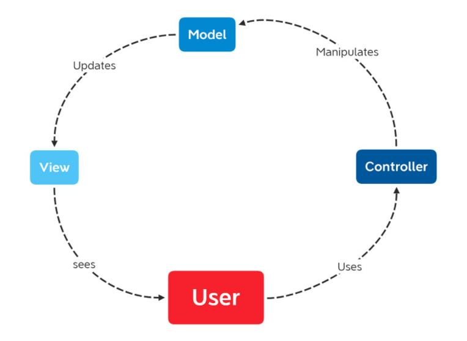
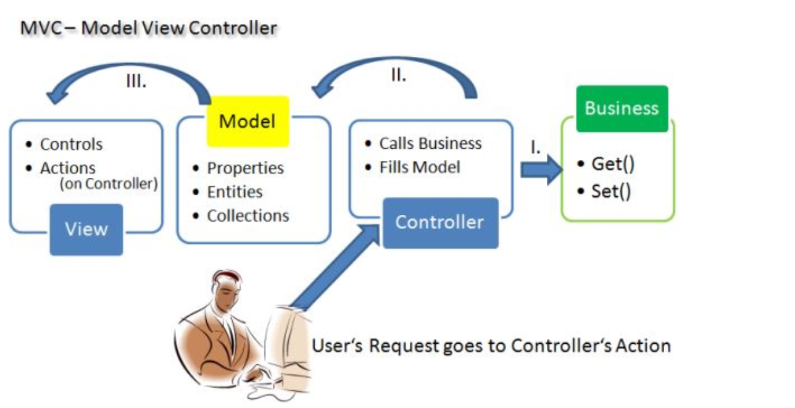

# [JAVA] - BUỔI 11: CÁC NGUYÊN TẮC THIẾT KẾ, MÔ HÌNH THIẾT KẾ
## A. SOLID LÀ GÌ? 
- Nguồn: https://topdev.vn/blog/solid-la-gi/
### I. Lịch sử ra đời:
1. Nguyên tắc SOLID ra đời để giúp ta phối hợp 4 tính chất của OOP(kế thừa, đa hình, trừu tượng, đóng gói) một cách hiệu quả và giúp ta sử dụng OOP 1 tốt hơn.
### II. Định nghĩa: 
#### 1. SOLID: 
- SOLID là viết tắt của 5 chữ cái đầu trong 5 nguyên tắc thiết kế hướng đối tượng. Giúp cho lập trình viên viết ra những đoạn code dễ đọc, dễ hiểu, dễ maintain. Nó được đưa ra bởi Robert C. Martin và Michael Feathers. 5 nguyên tắc đó bao gồm:
   - Single responsibility priciple (SRP)
   - Open/Closed principle (OCP)
   - Liskov substitution principe (LSP)
   - Interface segregation principle (ISP)
   - Dependency inversion principle (DIP)
#### 2. Chi tiết các nguyên tắc:
##### a. Single responsibility priciple (SRP): 
1. Nội dung: **Mỗi Class chỉ nên chịu trách nhiệm về 1 nhiệm vụ cụ thể**. Một class có quá nhiều chức năng sẽ trở nên cồng kềnh và trở nên khó đọc, khó maintain. Mà đối với ngành IT việc requirement thay đổi, cần thêm sửa chức năng là rất bình thường, nên việc code trong sáng, dễ đọc dễ hiểu là rất cần thiết.
2. VD:
   - Trong Sea Battle, có 3 tàu: 1 tàu xạ thủ, 1 tàu healing, 1 tàu tanker, mỗi tàu có 1 chức năng riêng. 
   - Vậy ta có nên tạo 1 lớp Ship với cả 3 chức năng Tấn công, Tạo khiên, Hồi máu không?
   - => Sẽ rất rối vì nếu ta có nhiều loại tàu khác thì cứ mỗi tàu lại thêm 1 phương thức
   - => Ta sẽ tạo 1 Interface Ship có chức năng War => Tạo 3 Class tàu và implement Ship và ghi đè lại phương thức đó.
##### b. Open/Closed principle (OCP)
1. Nội dung: 
   - **Không được sửa đổi một Class có sẵn, nhưng có thể mở rộng bằng kế thừa.**
   - Theo nguyên lý này, mỗi khi ta muốn thêm chức năng cho chương trình, chúng ta nên viết class mới mở rộng class cũ (bằng cách kế thừa hoặc sở hữu class cũ) chứ không nên sửa đổi class cũ. Việc này dẫn đến tình trạng phát sinh nhiều class, nhưng chúng ta sẽ không cần phải test lại các class cũ nữa, mà chỉ tập trung vào test các class mới, nơi chứa các chức năng mới.
   - Thông thường việc mở rộng thêm chức năng thì phải viết thêm code, vậy để thiết kế ra một module có thể dễ dàng mở rộng nhưng lại hạn chế sửa đổi code ta cần làm gì. Cách giải quyết là tách những phần dễ thay đổi ra khỏi phần khó thay đổi mà vẫn đảm bảo không ảnh hưởng đến phần còn lại.
##### c. Liskov substitution principe (LSP)
1. Nội dung:
   - **Các đối tượng (instance) kiểu class con có thể thay thế các đối tượng kiểu class cha mà không gây ra lỗi.**
2. Vd:
   - 1 công ti có 2 loại nhân viên: nv chính thức và lao công, bảo vệ. NV chính thức cần checkin-out còn lại thì không. Vậy ta có thể tạo 1 interface NV, có 2 phương thức working và checkin
   - Khi ta tạo class implement interface trên thì lao công lại vô tình có phương thức checkin của nv chính thức
   - Cách xử lý: SD: ISP
##### d. Interface segregation principle (ISP)
1. Nội dung: 
   - **Thay vì dùng 1 interface lớn, ta nên tách thành nhiều interface nhỏ, với nhiều mục đích cụ thể.**
   - Nguyên lý này rất dễ hiểu. Hãy tưởng tượng chúng ta có 1 interface lớn, khoảng 100 methods. Việc implements sẽ rất vất vả vì các class impliment interface này sẽ bắt buộc phải phải thực thi toàn bộ các method của interface. Ngoài ra còn có thể dư thừa vì 1 class không cần dùng hết 100 method. Khi tách interface ra thành nhiều interface nhỏ, gồm các method liên quan tới nhau, việc implement và quản lý sẽ dễ hơn
2. VD:
   - Cho VD trên, ta nên chia thành 2 Interface riêng là NV thời vụ là NV chính thức. NV chính thức mới có checkin.
##### e. Dependency inversion principle (DIP)
1. Nội dung: 
   - **Các module cấp cao không nên phụ thuộc vào các modules cấp thấp. Cả 2 nên phụ thuộc vào abstraction.**
   - **Interface (abstraction) không nên phụ thuộc vào chi tiết, mà ngược lại (Các class giao tiếp với nhau thông qua interface (abstraction), không phải thông qua implementation.)**
   - Có thể hiểu nguyên lí này như sau: những thành phần trong 1 chương trình chỉ nên phụ thuộc vào những cái trừu tượng (abstraction). Những thành phần trừu tượng không nên phụ thuộc vào các thành phần mang tính cụ thể mà nên ngược lại.
   - Những cái trừu tượng (abstraction) là những cái ít thay đổi và biến động, nó tập hợp những đặc tính chung nhất của những cái cụ thể. Những cái cụ thể dù khác nhau thế nào đi nữa đều tuân theo các quy tắc chung mà cái trừu tượng đã định ra. Việc phụ thuộc vào cái trừu tượng sẽ giúp chương trình linh động và thích ứng tốt với các sự thay đổi diễn ra liên tục.
2. Ví dụ:
   - Lấy ví dụ về ổ cứng của máy tính, bạn có thể dùng loại ổ cứng thể rắn SSD đời mới để chạy cho nhanh, tuy nhiên cũng có thể dùng ổ đĩa quay HDD thông thường. Nhà sản xuất Mainboard không thể nào biết bạn sẽ dùng ổ SSD hay loại HDD đĩa quay thông thường. Tuy nhiên họ sẽ luôn đảm bảo rằng bạn có thể dùng bất cứ thứ gì bạn muốn, miễn là ổ đĩa cứng đó phải có chuẩn giao tiếp SATA để có thể gắn được vào bo mạch chủ. Ở đây chuẩn giao tiếp SATA chính là interface, còn SSD hay HDD đĩa quay là implementation cụ thể.
## B. KISS, DRY, YAGNI.
### I. YAGNI: You Aren’t Gonna Need It
1. Nội dung:
   - Nguyên tắc này là dự án của bạn đang làm thì chỉ cần tập trung xây dựng chức năng quyết vấn đề ở thời điểm hiện tại, vấn đề mà khách hàng cần giải quyết, không cần lãng phí thời gian vào một chức năng "Có thể sử dụng đến". **=>  Đừng tự vẽ việc cho mình.**
### II. DRY: Don’t Repeat Yourself.
1. Nội dung: 
   - Đừng lặp lại code ở đây là không lặp lại các đoạn code giống nhau, các method thực hiện chức năng như nhau, cố gắng gom chúng lại 1 cách gọn gàng và có thể dùng lại khi cần.
2. VD: 
   - Có 2 hàm xuất: 1 hàm xuất thông tin cơ bản của 1 sinh viên(tên, tuối, msv). 1 hàm xuất ttin cơ bản của 1 người: (tên, tuổi, cccd) => Ta có thể tạo 1 hàm in tên tuổi và gọi lại riêng cho từng chức năng.
### III. KISS: Keep It Simple Stupid
1. Nội dung: 
   - KISS có nhiều biến thể khác nhau như "Keep It Short and Simple", "Keep It Simple and Straightforward" và "Keep It Small and Simple".
   - Tóm lại, hàm ý của nó vẫn hướng về một sự đơn giản và rõ ràng trong mọi vấn đề. Và như vậy, sự đơn giản là mục đích trọng tâm trong thiết kế, còn những cái phức tạp không cần thiết thì nên tránh.
   - Trong lập trình, KISS nghĩa là hãy làm cho mọi thứ (mã lệnh của bạn) trở nên đơn giản và dễ nhìn hơn. Hãy chia nhỏ vấn đề và giải quyết từng cái. Hãy để số lượng dòng code của một lớp hay phương thức ở con số hàng chục thôi.
   - Đừng viết những lớp hay phương thức theo kiểu tổng hợp hay lẫn lộn (tất cả trong một), hãy để mọi thứ thật đơn giản để bạn luôn có thể hiểu được, và kết hợp chúng với nhau để giải quyết được các bài toán lớn.
## C. Mô hình MVC (Model-View-Controller).
- Nguồn: https://devmaster.edu.vn/mvc-la-gi-tong-quan-ve-mo-hinh-mvc-trong-lap-trinh.html.
### 1. Định nghĩa, ra đời.
1. Định nghĩa: 
   - Thuật ngữ MVC là tên viết tắt của Model-View-Controller. Được hiểu là một mẫu kiến trúc phần mềm dùng để tạo lập giao diện người dùng trên máy tính. Trong đó, Model là để xử lý dữ liệu, Controller để xử lý logic, View là phần hiển thị và tiếp nhận request từ phía người dùng. Mô hình này chia một ứng dụng thành 3 phần tương tác với nhau có tác dụng tách biệt giữa cách thức thông tin được xử lý nội hàm và phần thông tin trình bày, tiếp nhận từ phía người dùng.
2. Lịch sử ra đời: 
   - MVC xuất hiện tư những năm 70 của thế kỷ XX. Không phụ thuộc vào môi trường , nền tảng xây dựng hay ngôn ngữ phát triển. Các công ty lập trình đều áp dụng mô hình này vào các dự án trong môi trường Windows, Linux … Chúng cũng có thể sử dụng bất kỳ ngôn ngữ nào như PHP, JPS, ASP… . MVC tượng trưng cho dữ liệu của chương trình phần mềm. Tầm nhìn hay khung nhìn là bao gồm các thành phần của giao diện người dùng. Bộ kiếm tra/ bộ điều chỉnh có chức năng quản lý sự trao đổi giữa dữ liệu và nguyên tắc nghề nghiệp trong các thao tác liên quan đến mô hình MVC. Mục đích chính là nhằm chia nhỏ code để dễ dàng phát triển cũng như bảo trì.
### 2. Các thành phần của MVC.

1. **Model**:  chính là thành phần chứa những nghiệp vụ tương tác với dữ liệu hay hệ quản trị cơ sở dữ liệu. Phần này bao gồm các class hay funcition có khả năng xử lý nhiều nghiệp vụ như: kết nối database, thêm/ xóa/ sửa dữ liệu, truy vấn dữ liệu…
2. **View**: chính là phần chứa những giao diện tương tự như một nút bấm, khung nhập, menu, hình ảnh. View đảm nhiệm chức trách hiển thị dữ liệu, giúp người dùng tương tác với hệ thống.
3. **Controller**: là phần tiếp nhận mọi yêu cầu xử lý của người dùng. Nó bao gồm những class/ funcition có khả năng xử lý nhiều nghiệp vụ logic. Giúp lấy dữ liệu đúng những thông tin cần thiết nhờ vào các nghiệp vụ lớp Model cung cấp và hiển thị các dữ liệu đó ra cho người dùng.
4. **Tương tác giữa M-V-C**:
   1. C-V: Lấy những hình ảnh, nút bấm hay hiển thị những dữ liệu được trả ra từ Controller để giúp cho người dùng có thể quan sát và thao tác dễ dàng. 1 số nút bấm sẽ không cần đến Model để hoạt động. VD: ấn vào 1 nút thì nút đó sẽ phát sáng chẳng hạn.
   2. C-M: Trong khi đó, Controller – Model lại là luồng xử lý khi Controller tiếp nhận những yêu cầu và tham số đầu vào ở người dùng. Controller lúc này sẽ sử dụng những lớp/ hàm có trong model để lấy ra những dữ liệu chính xác nhất mà người dùng cần.
   3. V-M: Hai thành phần View – Model có thể tương tác với nhau mà không cần thông qua Controller. Nó chỉ đảm nhận nhiệm vụ hiển thị dữ liệu mà không phải qua bất kỳ xử lý nghiệp vụ logic nào. Tương tự với các vùng dữ liệu hiển thị tĩnh trên các website giống như block slidebar.
### 3. Mô hình MCV trong lập trình hoạt động ntn?

1. **Áp dụng với các dự án của website, mô hình MVC hoạt động theo quy trình cụ thể như sau:**
- Người dùng sử dụng một Browser của trình duyệt web bất kỳ, có thể là Firefox, Chrome hay IE…để gửi yêu cầu. Có thể gửi kèm theo những dữ liệu nhập tới các Controller xử lý tương ứng. Và yêu cầu xác định Controller xử lý cũng sẽ dựa vào bộ Routing điều hướng.
- Khi Controller đã nhận được yêu cầu gửi tới từ phía người dùng, thành phần này sẽ chịu trách nhiệm kiểm tra yêu cầu xem có cần lấy dữ liệu từ Model hay không. Nếu cần nó sẽ sử dụng các class/ function cần thiết có trong model và trả ra kết quả. Lúc này, Controller sẽ xử lý các giá trị đó, sau đó trả ra View để hiển thị. Controller lại làm công việc xác định các view tương ứng để hiển thị theo đúng yêu cầu của người dùng.
- Khi đã nhận được dữ liệu từ Controller, View sẽ có trách nhiệm xây dựng các thành phần hiển thị bao gồm: thông tin dữ liệu, hình ảnh…Sau đó trả về GUI Content để Controller đưa ra kết quả trên màn hình Browser. Cùng với đó, Browser sẽ nhận giá trị kết quả trả về và hiển thị ra cho người dùng.
### 4.Tại sao nên sử dụng mô hình MVC?        
- Có thể nói, mô hình MVC được xem là một chuẩn mô hình, chúng đóng vai trò rất quan trọng trong quá trình thiết kế website giới thiệu chuyên nghiệp cũng như bảo trì hệ thống website hay một ứng dụng, phần mềm. Nó có thể tạo ta một mô hình đa chiều với 3 lớp tách biệt, tương tác với nhau. Từ đó giúp cho các chuyên gia có thể dễ dàng dựa vào mô hình đó để trao đổi, xử lý nghiệp vụ một cách nhanh chóng, hiệu quả nhất.
- Với cơ chế hoạt động tối ưu, mô hình MVC có thể áp dụng cho nhiều loại dự án khác nhau như: dự án xây dựng và phát triển website, dự án ứng dụng phần mềm…Phần mềm phát triển theo mô hình MVC còn tạo nhiều điều kiện thuận lợi cho việc bảo trì những nguyên tắc  nghề nghiệp và giao diện ít liên quan với nhau.
- MVC còn giúp phân tách phần hiển thị và dữ liệu. Cho phép sửa đổi trong từng dữ liệu mà không làm ảnh hưởng đến bất kỳ dữ liệu nào khác. Chính vì thế nó được sử dụng rộng rãi cho các website trong nhiều loại dự án và công nghệ lớn.
### 5. Khi nào nên sử dụng MVC?
- Mô hình MVC được tạo ra và hữu ích trong việc tạo cấu trúc cho nhiều trang web và nhiều ứng dụng tiên tiến. Nên sử dụng MVC khi việc kết nối giữa View với các phần còn lại của ứng dụng không phải lúc nào cũng cùng available. Lúc này bạn không thể sử dụng MVP hay MVVM hiệu quả được mà bắt buộc phải thay thế bằng MVC.