# [JAVA] - BUỔI 12 (FINAL): THƯ VIỆN ĐỒ HOẠ SWING
## I. Thư viện đồ họa Swing cơ bản
### 1. Định nghĩa:
- Java Swing là một bộ công cụ lập trình giao diện trong Java cung cấp vô số thành phần dùng để lập trình ứng dụng desktop được phát hành bởi Sun Microsystems.
- Thư viện Swing được xây dựng dựa trên Java Abstract Widget Toolkit (AWT) cũng là một bộ công cụ lập trình giao diện cũ được phát triển trước đây. Chúng ta có thể sử dụng các thành phần giao diện như Button, TextBox etc mà không cần phải tạo lại chúng.
### 2. Chi tiết:
#### a. Sơ đồ phân cấp:
- 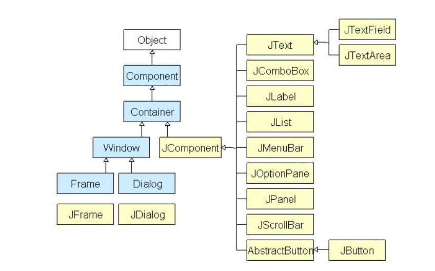
- Tất cả các thành phần trong Swing đại diện là JComponent có thể được thêm vào các **Container Class**.
#### b. Container Class: JPanel, JFrame, JDialog.
1. Panel: Đây là một containter thuần tuý nhất dùng cho mục đích tổ chức các layout trên một màn hình chính.
2. Frame: Đây là một container với đầy đủ các chức năng, được xem như là một màn hình chính trong ứng dụng.
3. Dialog: Nó có thể được coi như một cửa sổ bật lên khi chúng ta cần hiển thị tin nhắn đến người dùng. Dialog không được xem là một màn hình chính trong ứng dụng giống như Frame
#### c. JFrame:
1. ĐN, Khai báo:
   1. Lớp JFrame là một lớp kế thừa từ java.awt.Frame mà bổ sung các hỗ trợ cho cấu trúc thành phần JFC/Swing. Cú pháp khai báo cho lớp javax.swing.JFrame là:
   2. ```java
        public class JFrame
        extends Frame
            implements WindowConstants, Accessible, RootPaneContainer
        ```
2. Constructor:
   1. JFrame(): Xây dựng một Frame mới, ban đầu là không nhìn thấy (invisible).
   2. JFrame(GraphicsConfiguration gc): Tạo một Frame trong GraphicsConfiguration đã cho của một thiết bị màn hình và một title trống.
   3. JFrame(String title): Tạo một Frame mới, ban đầu là không nhìn thấy (invisible) với title đã cho.
   4. JFrame(String title, GraphicsConfiguration gc): Tạo một Frame với title đã cho và GraphicsConfiguration đã cho của một thiết bị màn hình.
3. Methods:
   1. setTitle(String title): set tiêu đề.
   2. setSize(int width, int height)
   3. setDefaultCloseOperation(int operation): Set 1 phương thức đóng mặc định cho JFrame. Khi cửa sổ đóng thì chương trình cũng dừng. Các lựa chọn cho *Operation* có thể là: JFrame.EXIT_ON_CLOSE, JFrame.HIDE_ON_CLOSE, and JFrame.DO_NOTHING_ON_CLOSE.
   4. setVisible(boolean b): dùng điều kiện b để đóng mở Frame.
   5. setLayout(LayoutManager manager): Set các Layout sẵn có cho Frame.
   6. add(Component comp): Add các thành phần vào Frame.
   7. remove(Component comp)
   8. validate(): Buộc trình quản lý bố cục tính toán lại bố cục của các thành phần trong JFrame. ???
   9. setResizable(boolean resizable): Đkien giúp ng dùng thay đổi kích cỡ Frame
   10. setIconImage(Image image).
4.  VD:
    1.  ```java
         public class TEstFrame {
         public static void main(String[] args) {
            JFrame jFrame = new JFrame();
            
            jFrame.setTitle("Demo JFrame");
            jFrame.setSize(500, 500);
            jFrame.setLocationRelativeTo(null);
            
            
            JButton jbutton1 = new JButton("Button1");
            JButton jbutton2 = new JButton("Button2");
            
            jFrame.setLayout(new BorderLayout());
            jFrame.add(jbutton1, BorderLayout.CENTER);
            jFrame.add(jbutton2, BorderLayout.NORTH);
            jFrame.setDefaultCloseOperation(JFrame.EXIT_ON_CLOSE);
            jFrame.setVisible(true);
         }
         
      }
      ```
    2. OUT: 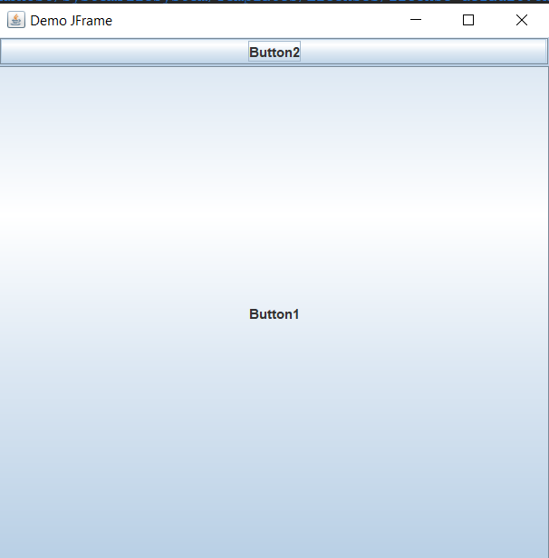
#### d. JPanel
1. Constructor:
   1. JPanel(): Tạo một JPanel mới với một double buffer và một Flow Layout.
   2. JPanel(boolean isDoubleBuffered): Tạo một JPanel mới với Flow Layout và trình đệm đã xác định.
   3. JPanel(LayoutManager layout): Tạo một JPanel mới với Layout Manager đã cho
   4. JPanel(LayoutManager layout, boolean isDoubleBuffered): Tạo một JPanel mới với Layout Manager đã cho và trình đệm đã xác định.
2. Các phương thức của lớp JPanel
   1. add();
   2. setLayout();
   3. AccessibleContext getAccessibleContext(): Lấy AccessibleContext được liên kết với JPanel này.
   4. PanelUI getUI(): Trả về đối tượng L&F mà truyền thành phần này
   5. String getUIClassID(): Trả về một chuỗi xác định tên của lớp L&F mà truyền thành phần này
   6. protected String paramString(): Trả về một biểu diễn chuỗi của JPanel này
   7. void setUI(PanelUI ui): Thiết lập đối tượng L&F mà truyền thành phần này
   8. void updateUI():Phục hồi thuộc tính UI về một giá trị Look và Feel hiện tại.
#### e. JButton, JLabel, JTextField, JTable, JList, JTextArea
##### 1. JButton: 
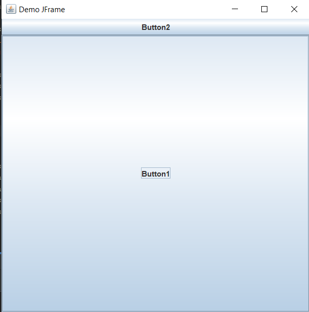
1. ĐN: Lớp JButton trong Java Swing được sử dụng để tạo một nút có thể click. Thành phần này có một label và tạo một sự kiện (event) khi được nhấn. Bạn cũng có thể chèn ảnh vào button.
2. Lớp JButton có các constructor sau:
   1. JButton(): Tạo một button mà không thiết lập text hoặc icon.
   2. JButton(Action a): Tạo một button tại đây các thuộc tính được nhận từ Action đã cung cấp.
   3. JButton(Icon icon): Tạo một button với một icon.
   4. JButton(String text): Tạo một button với text.
   5. JButton(String text, Icon icon): Tạo một button với text ban đầu và một icon.
3. Một số phương thức được sử dụng phổ biến của của lớp AbstractButton
   1. public void setText(String s): được sử dụng để thiết lập text đã cho trên button.
   2. public String getText(): được sử dụng để trả về text của button.
   3. public void setEnabled(boolean b): được sử dụng để kích hoạt hoặc vô hiệu hóa button.
   4. public void setIcon(Icon b): được sử dụng để thiết lập Icon đã cho trên button.
   5. public Icon getIcon(): được sử dụng để lấy Icon của button.
   6. public void setMnemonic(int a): được sử dụng để thiết lập thuộc tính mnemonic trên button.
   7. public void addActionListener(ActionListener a): được sử dụng để thêm action listener tới đối tượng này.
##### 2. JLabel: 
1. ĐN: Lớp JLabel trong Java Swing có thể hiển thị hoặc text, hoặc hình ảnh hoặc cả hai. Các nội dung của Label được gán bởi thiết lập căn chỉnh ngang và dọc trong khu vực hiển thị của nó. Theo mặc định, các label được căn chỉnh theo chiều dọc trong khu vực hiển thị. Theo mặc định, text-only label là căn chỉnh theo cạnh, image-only label là căn chỉnh theo chiều ngang.
2. Constructor của lớp JLabel trong Java Swing
   1. JLabel(): Tạo một instance của JLabel, không có hình ảnh, và với một chuỗi trống cho title.
   2. JLabel(Icon image): Tạo một instance của JLabel với hình ảnh đã cho.
   3. JLabel(Icon image, int horizontalAlignment): Tạo một instance của JLabel với hình ảnh và căn chỉnh ngang đã cho.
   4. JLabel(String text): Tạo một instance của JLabel với text đã cho.
   5. JLabel(String text, Icon icon, int horizontalAlignment): Tạo một instance của JLabel với text, hình ảnh, và căn chỉnh ngang đã cho.
   6. JLabel(String text, int horizontalAlignment): Tạo một instance của JLabel với text và căn chỉnh ngang đã cho.
3. VD: 
```java
public class TEstFrame {
    public static void main(String[] args) {
        JFrame jFrame = new JFrame();
        
        jFrame.setTitle("Demo JFrame");
        jFrame.setSize(100, 200);
        jFrame.setLocationRelativeTo(null);
        
        
        JLabel jLabel = new JLabel("Hello World");
        JButton jbutton2 = new JButton("Button2");
        
        jFrame.setLayout(new BorderLayout());
        jFrame.add(jLabel, BorderLayout.CENTER);
        jFrame.add(jbutton2, BorderLayout.SOUTH);
        jFrame.setDefaultCloseOperation(JFrame.EXIT_ON_CLOSE);
        jFrame.setVisible(true);
    }
}
```
##### 3. JTextField:
1. ĐN: Lớp JTextField trong Java Swing là một thành phần cho phép sửa đổi **một dòng text đơn**. 
2. Các constructor của lớp JTextField trong Java Swing
   1. JTextField(): Xây dựng một TextField mới.
   2. JTextField(Document doc, String text, int columns): Xây dựng một JTextField mới mà sử dụng mô hình lưu trữ text đã cho và số cột đã cho.
   3. JTextField(int columns): Xây dựng một TextField mới và trống với số cột đã cho.
   4. JTextField(String text): Xây dựng một TextField mới được khởi tạo với text đã cho.
   5. JTextField(String text, int columns): Xây dựng một TextField mới được khởi tạo với text và các cột đã cho.
3. Các phương thức được sử dụng phổ biến của lớp JTextField trong Java Swing
   1. void setActionCommand(String command): Thiết lập chuỗi lệnh được sử dụng cho action event
   2. void setColumns(int columns): Thiết lập số cột trong TextField này, và sau đó làm mất hiệu lựa layout đó
   3. void setDocument(Document doc): Liên kết editor với một tài liệu text
   4. void setFont(Font f): Thiết lập font hiện tại
   5. void setHorizontalAlignment(int alignment): Thiết lập căn chỉnh ngang cho text
   6. void setScrollOffset(int scrollOffset): Thiết lập scroll offset, giá trị pixel
   7. protected void actionPropertyChanged(Action action, String propertyName): Cập nhật trạng thái của textfield trong phản hồi các thay đổi của thuộc tính trong action liên kết với
   8. void addActionListener(ActionListener l): Thêm action listener đã cho để nhận các action event từ textfield này
   9. protected void configurePropertiesFromAction(Action a): Thiết lập các thuộc tính của textfield này để kết nối chúng trong Action đã cho
   10. protected PropertyChangeListener: createActionPropertyChangeListener(Action a)
   Tạo và trả về PropertyChangeListener mà chịu trách nhiệm nghe các thay đổi từ Action đã cho và cập nhật các thuộc tính thích hợp
   11. protected Document createDefaultModel(): Tạo trình triển khai mặc định của model để được sử dụng tại sự xây dựng nếu không được cung cấp tường minh
   12. Action[] getActions(): Gọi danh sách lệnh cho trình soạn thảo Editor
   13. void postActionEvent(): Xử lý action event xảy ra trên textfield này bằng cách gửi chúng tới bất cứ đối tượng ActionListener đã được đăng ký nào
   14. void removeActionListener(ActionListener l): Xóa action listener đã cho để nó không bao giờ nhận action event từ textfield này nữa
   15. void scrollRectToVisible(Rectangle r): Cuốn trường này sang trái hoặc phải
   16. void setAction(Action a): Thiết lập Action cho ActionEvent source
4.  VD: 
    1.  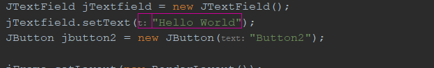
    2.  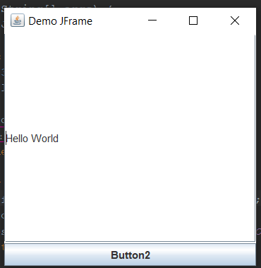
##### 4. JTextArea
- Tương tự JTextField nhưng có thể viết trên nhiều dòng.
##### 5. JTable
1. ĐN: Lớp JTable trong Java Swing được sử dụng để hiển thị dữ liệu trên các ô của bảng hai chiều. 
2. Các constructor được sử dụng phổ biến của lớp JTable là:
   1. JTable(): Tạo một bảng với các ô trống.
   2. JTable(Object[][] rows, Object[] columns): Tạo một bảng với dữ liệu đã cho.
3. VD: 
```java
public class TEstFrame {
    public static void main(String[] args) {
        JFrame jFrame = new JFrame();
        
        jFrame.setTitle("Demo JFrame");
        jFrame.setSize(300, 500);
        jFrame.setLocationRelativeTo(null);
        
//        JTextField jTextfield = new JTextField();
//        jTextfield.setText("Hello World");
//        JButton jbutton2 = new JButton("Button2");

        String data[][] = { { "101", "Tran Van Minh", "6000" }, 
                { "102", "Phan Van Tai", "8000" }, 
                { "101", "Do Cao Hoc", "7000" } };
        String column[] = { "ID", "NAME", "SALARY" };
 
        JTable jt = new JTable(data, column);
        jt.setBounds(30, 40, 200, 300);
        jFrame.add(jt);
     
        jFrame.setLayout(new BorderLayout());
        jFrame.setDefaultCloseOperation(JFrame.EXIT_ON_CLOSE);
        jFrame.setVisible(true);
    }
}
```
- out: 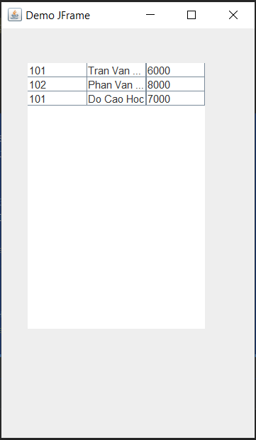
##### 6. JList:
1. ĐN: Lớp JList là một thành phần mà hiển thị một danh sách các đối tượng và cho phép người dùng lựa chọn một hoặc nhiều item. Một Model riêng rẽ, ListModel, duy trì các nội dung của list. 
2. Các constructor của lớp JList trong Java Swing
- JList(): Xây dựng một JList với một model là empty, read-only.
- JList(ListModel dataModel): Xây dựng một JList mà hiển thị các phần tử từ model đã cho và non-null.
- JList(Object[] listData): Xây dựng một JList mà hiển thị các phần tử trong mảng đã cho.
- JList(Vector<?> listData): Xây dựng một JList mà hiển thị các phần tử trong Vector đã cho.
3. VD:
```java
String week[]= { "Monday","Tuesday","Wednesday","Thursday","Friday","Saturday","Sunday"};
        //create list
        JList jList = new JList(week);
        jList.setSelectedIndex(2);
        jFrame.add(jList);
     
        jFrame.setLayout(new FlowLayout());
        jFrame.setDefaultCloseOperation(JFrame.EXIT_ON_CLOSE);
        jFrame.setVisible(true);
```
- out: 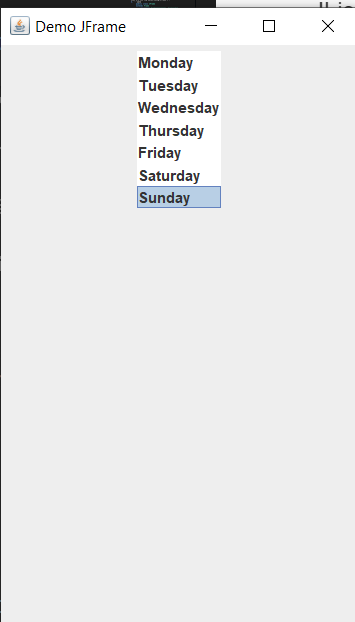
#### f. Các Layout:
##### 1. BorderLayout(): 
1. ĐN: Lớp BorderLayout trong Java Swing sắp xếp các thành phần để phù hợp với 5 miền: EAST, WEST, SOUTH, NORTH và CENTER. Nó là layout mặc định của Frame hoặc Window. Mỗi khu vực (miền) chỉ có thể chứa một thành phần và mỗi thành phần trong mỗi khu vực được nhận diện bởi các hằng tương ứng là:
   1. public static final int NORTH
   2. public static final int SOUTH
   3. public static final int EAST
   4. public static final int WEST
   5. public static final int CENTER
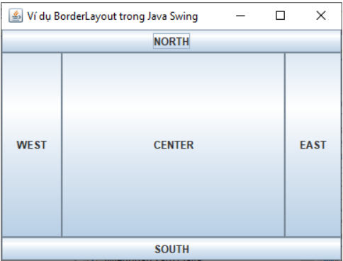
##### 2. GridLayout()
1. ĐN: Layout dạng bảng. 
2. Lớp GridLayout gồm các constructor sau:
   1. GridLayout(): Tạo một grid layout với mặc định là một cột mỗi thành phần, trong một hàng đơn.
   2. GridLayout(int rows, int columns): Tạo một grid layout với số hàng và cột đã cho, và không có khoảng cách giữa các thành phần.
   3. GridLayout(int rows, int columns, int hgap, int vgap): Tạo một grid layout với các hàng và cột đã cho cùng với các khoảng cách theo chiều dọc và ngang đã xác định.
3. VD:
   1. 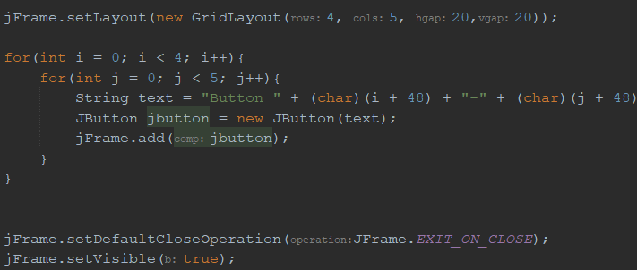
   2. 
##### 3. Flow Layout:
1. ĐN: Lớp FlowLayout trong Java Swing được sử dụng để sắp xếp các thành phần trong một line, line sau nối tiếp line trước (trong một luồng từ trái qua phải left-to-right flow). Nó là Layout mặc định của applet hoặc panel. 
3. VD:
   - 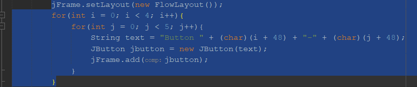
   - 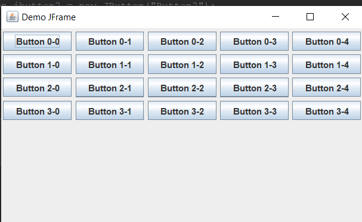
#### g. Image, Graphics2D
##### 1. Image:
1. ĐN: Lớp Image trong Java là một lớp trừu tượng cho tất cả các lớp khác được sử dụng để biểu diễn hình ảnh đồ họa.
2. Các phương thức:
   1. flush(): Xóa tất cả các tài nguyên có thể tái tạo đang được sử dụng bởi đối tượng Image này.
   2. getAccelerationPriority(): Trả về giá trị hiện tại của gợi ý ưu tiên tăng tốc.
   3. ImageCapabilities	getCapabilities(GraphicsConfiguration gc): Trả về một đối tượng ImageCapabilities có thể là được hỏi về khả năng của việc này Hình ảnh trên GraphicsConfiguration được chỉ định.
   4. abstract Graphics	getGraphics(): Tạo bối cảnh đồ họa để vẽ thành hình ảnh ngoài màn hình
   5. getHeight(ImageObserver observer): Xác định chiều cao của hình ảnh.
   6. getProperty(String name, ImageObserver observer): Nhận một thuộc tính của hình ảnh này theo tên.
   7. getScaledInstance(int width, int height, int hints): Tạo một phiên bản thu nhỏ của hình ảnh này.
   8. abstract ImageProducer	getSource(): Lấy đối tượng tạo ra các pixel cho hình ảnh.
   9. getWidth(ImageObserver observer): Xác định chiều rộng của hình ảnh.
   10. void setAccelerationPriority(float priority): Đặt gợi ý cho ảnh này về tầm quan trọng của việc tăng tốc.
##### 2. Buffered Image:
1. Cac buoc:
-  ```java
   File file = new File("C:\\Users\\Admin\\Desktop\\Java PRO\\Chuẩn bị\\Buổi 12\\image.jpg");
   bufferedImage = new BufferedImage(w, h, BufferedImage.TYPE_INT_ARGB); // w, h, int: rộng , cao, loại bảng màu.
   bufferedImage = ImageIO.read(file);
   ``` 
- 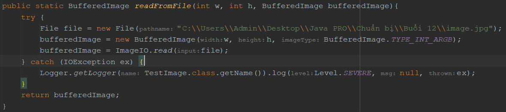
2.  Đọc hình ảnh ra file:
- ```java
   public static void writeToFile(int w, int h, BufferedImage bufferedImage){
         try {
               File file_out = new File("C:\\Users\\Admin\\Desktop\\Java PRO\\Chuẩn bị\\Buổi 12\\image_out1.jpg");
               ImageIO.write(bufferedImage, "png", file_out);
         } catch (IOException ex) {
               Logger.getLogger(TestImage.class.getName()).log(Level.SEVERE, null, ex);
         }
      }
   ```
- Nó sẽ tạo 1 hình ảnh mới(nếu chưa có file tên như đã nhập) hoặc thay hình ảnh cũ bằng hình ảnh nhập vào.

3. C3: 
- ```java
   try {
      bufferedImage = ImageIO.read(getClass().getResourceAsStream("/imagee/Paomedia-Small-N-Flat-Clock.48.png"));
   } catch (IOException ex) {
         Logger.getLogger(View.class.getName()).log(Level.SEVERE, null, ex);
   }
   ```
##### 2. Graphics:
1. ĐN: Lớp Graphics trong Java cung cấp nhiều phương thức để lập trình đồ họa.
2. Phương thức:
- public abstract void drawString(String str, int x, int y): được sử dụng để vẽ chuỗi đã cho.
- public void drawRect(int x, int y, int width, int height): vẽ một hình chữ nhật với độ rộng width và chiều cao height đã cho.
- public abstract void fillRect(int x, int y, int width, int height): được sử dụng để điền màu mặc định và độ rộng và chiều cao đã cho vào hình chữ nhật.
- public abstract void drawOval(int x, int y, int width, int height): được sử dụng để vẽ hình Ovan với độ rộng và chiều cao đã cho.
- public abstract void fillOval(int x, int y, int width, int height): được sử dụng để điền màu mặc định và độ rộng và chiều cao đã cho vào hình Oval.
- public abstract void drawLine(int x1, int y1, int x2, int y2): được sử dụng để vẽ line giữa hai điểm có tọa độ lần lượt là (x1, y1) và (x2, y2).
- public abstract boolean drawImage(Image img, int x, int y, ImageObserver observer): được sử dụng để vẽ hình ảnh đã cho.
- public abstract void drawArc(int x, int y, int width, int height, int startAngle, int arcAngle): được sử dụng để vẽ đường tròn circular hoặc elip.
- public abstract void fillArc(int x, int y, int width, int height, int startAngle, int arcAngle): được sử dụng để điền một hình tròn hoặc elip.
- public abstract void setColor(Color c): được sử dụng để thiết lập màu hiện tại của đồ họa thành màu color đã cho.
- public abstract void setFont(Font font): được sử dụng để thiết lập font hiện tại của đồ họa thành font đã cho.

1. VD: 
```java
import java.awt.Canvas;
import java.awt.Color;
import java.awt.Graphics;
 
import javax.swing.JFrame;
 
public class DisplayGraphics extends Canvas {
    public void paint(Graphics g) {
        g.drawString("Hello", 40, 40);
        setBackground(Color.WHITE);
        g.fillRect(130, 30, 100, 80);
        g.drawOval(30, 130, 50, 60);
        setForeground(Color.RED);
        g.fillOval(130, 130, 50, 60);
        g.drawArc(30, 200, 40, 50, 90, 60);
        g.fillArc(30, 130, 40, 50, 180, 40);
 
    }
 
    public static void main(String[] args) {
        DisplayGraphics m = new DisplayGraphics();
        JFrame f = new JFrame();
        f.add(m);
        f.setSize(400, 300);
        f.setVisible(true);
    }
} 
```
- Chạy chương trình Java trên cho kết quả như sau:
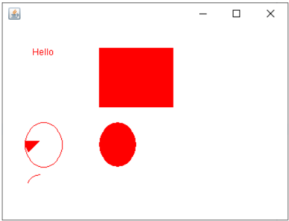
##### 3. Graphics2D: là 1 lớp con của Graphics và có thêm 1 số phương thức hỗ trợ tốt hơn cho 
### 3. GUI trong Java là gì
GUI viết tắt của Graphical User Interface cung cấp một bộ công cụ cho phép các lập trình viên có thể xây dựng các ứng dụng có giao diện đồ hoạ. Nó chủ yếu được làm bằng các thành phần đồ họa cơ bản như Button, Label, Windows, v.v. qua đó người dùng có thể tương tác với các ứng dụng. Swing GUI trong Java đóng một vai trò quan trọng trong việc xây dựng giao diện dễ dàng.
