# Buổi 7: 1 số CTDL thường thấy trong Java
## 1. Interface Iterable, Collection -> List, Set, Queue;
### 1. Iterator Interface và Iterable Interface:
1. Iterator Interface : 
   1. Là 1 Interface cho phép truy cập vào các phần tử của 1 tập hợp và sử dụng để duyệt các phần tử của tập đó (VD: Map,List,Set). Nó giúp ta dễ dàng truy xuất phần tử và thực hiện thao tác của từng phần tử.
   2. Ưu điểm chính:

      1. Linh hoạt: Hoạt động trơn tru với nhiều loại tập hợp.
      2. Sửa đổi: Cho phép bạn xóa các phần tử trong khi lặp, điều này không thể thực hiện được với vòng lặp for đơn giản.
      3. Hiệu suất: Có thể được tối ưu hóa cho các triển khai tập hợp cụ thể, nâng cao hiệu quả.
      4. An toàn: Ngăn chặn ConcurrentModificationException, một vấn đề phổ biến khi sửa đổi các tập hợp trong khi lặp bằng các phương thức khác.
   3. Các phương thức cốt lõi của Interface Iterator:
      - hasNext(): Trả về true nếu có nhiều phần tử hơn để lặp qua, false nếu không.
      - next(): Trả về phần tử tiếp theo trong tập hợp và di chuyển bộ lặp về phía trước.
      - remove(): Xóa phần tử cuối cùng được trả về bởi next() khỏi tập hợp cơ bản.
   4. VD:
        ``` java
        import java.util.ArrayList;
        import java.util.Iterator;

        public class IteratorExample {
            public static void main(String[] args) {
                ArrayList<String> colors = new ArrayList<>();
                colors.add("Đỏ");
                colors.add("Xanh");
                colors.add("Xanh lam");

                Iterator<String> itr = colors.iterator();

                while (itr.hasNext()) {
                    String color = itr.next();
                    System.out.println(color);

                    if (color.equals("Xanh")) {
                        itr.remove(); // Xóa "Xanh" trong khi lặp
                    }
                }
            }
        }

        ```
    - Trong VD trên có thể sử dụng vòng lặp For-each
2. Iterable Interface 
   1. ĐN: 
      1. Là 1 Marker Interface(Interface không có phương thức ) cho biết khả năng của một tập hợp được lặp qua bằng một Iterator.
      2. Iterable là một giao diện **đánh dấu cho biết một tập hợp có thể được lặp qua bằng một Iterator**. Nó hoạt động như một hợp đồng, cho biết một lớp có thể cung cấp cách truy cập các phần tử của nó theo thứ tự tuần tự.

    2. Các điểm chính:
       1. Collection FrameWork: Tất cả các Collections trong Java mà implement Iterable, thì đều có thể sử dụng for-each và Iterator cho nó
       2. Phương thức iterator(): Các lớp triển khai Iterable phải cung cấp phương thức iterator(), trả về một đối tượng Iterator để duyệt qua các phần tử của tập hợp.
       3. Vòng lặp for-each: Vòng lặp for-each bên trong sử dụng một Iterator để lặp qua một tập hợp. Đây là cách ngắn gọn để truy cập các phần tử:
          1. 
            ```java
            for (String element : myArrayList) {
                System.out.println(element);
            }
            ```
    3. VD:
    -   ```java
        // ArrayList triển khai Iterable
        ArrayList<String> names = new ArrayList<>();
        names.add("Alice");
        names.add("Bob");
        names.add("Charlie");

        // Lấy một Iterator bằng iterator()
        Iterator<String> iterator = names.iterator();

        while (iterator.hasNext()) {
            String name = iterator.next();
            System.out.println(name);
        }
        ```
3. So sánh Iterator và iterable:
   1. ĐN
      1. Iterator là một đối tượng cho phép bạn duyệt qua các phần tử của một tập hợp theo thứ tự tuần tự. Nó có ba phương thức chính:
      2. Iterable là một giao diện đánh dấu cho biết một lớp có thể được lặp qua bằng một Iterator. Các lớp triển khai Iterable phải cung cấp phương thức iterator(), trả về một đối tượng Iterator.
      3. Về cơ bản, Iterator là một công cụ được sử dụng để duyệt qua các phần tử của một tập hợp, trong khi Iterable là một dấu hiệu cho biết một lớp có thể được duyệt qua bằng một Iterator.
   2. Vòng lặp for-each sử dụng một Iterator để duyệt qua các phần tử của một tập hợp. Điều này có nghĩa là bạn có thể sử dụng vòng lặp for-each để duyệt qua bất kỳ tập hợp nào triển khai Iterable.
   3. 
      - Trong ví dụ này, ArrayList triển khai Iterable. Điều này có nghĩa là chúng ta có thể sử dụng vòng lặp for-each để duyệt qua các phần tử của ArrayList.

### 2. Collection và Collections: 
1. Định nghĩa:
   1. Collection: 
      1. Là 1 root interface trong hệ thống cấp bậc của Collection :
      2. Cung cấp nhiều Interface(Set,List,Quêu,..) và các lớp (ArrayList,...)
   2. Collections:
      1. Là hệ thống các **phương thức static** để thao tác tới các nhóm đối tượng.: VD: sort(), min(), max() 
   3. 
2. Các phương thức :
   1. Collection
      1. Thông qua Iterator Interface:
         - 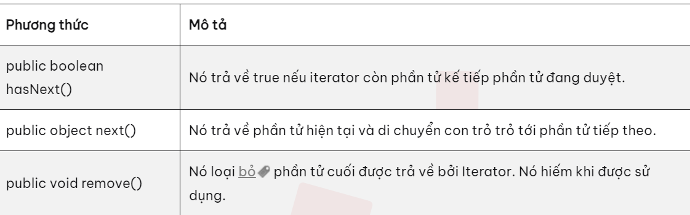
      2. Các phương thức thuộc Interface Collection:, các phương thức này có thể OverRide
         1. 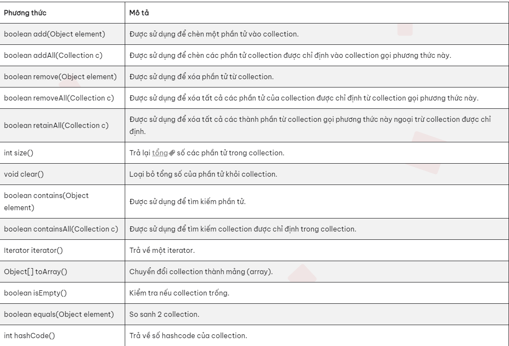
   2. Collections:
      1. Các phương thức static:
         - 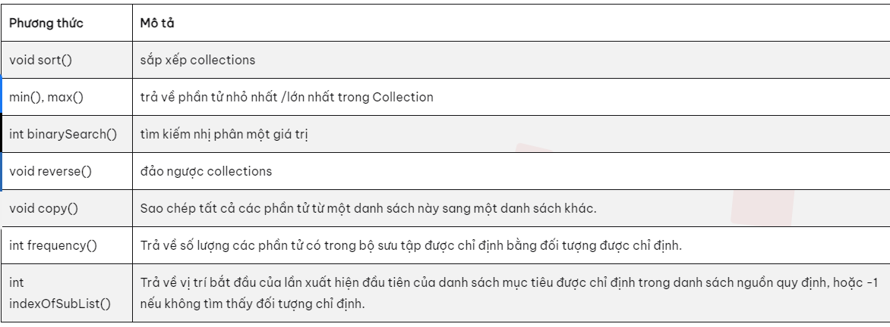
         - 
### 3. Các Interface Collection thường gặp:

1. List:
   1. Khai báo: ``` public interface List<E> extends Collectiono<E>```
   2. Các method: 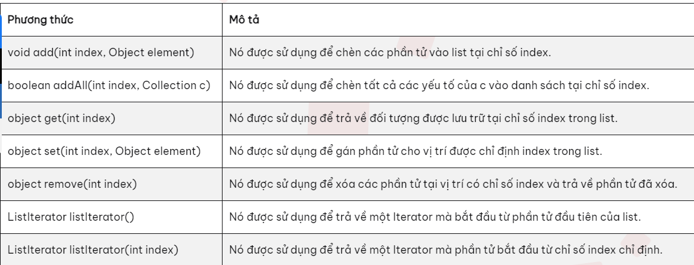
2. Array List:
   1. Lớp ArrayList trong java là một lớp kế thừa lớp AbstractList và triển khai của List Interface nên nó sẽ có một vài đặc điểm và phương thức tương đồng với List.

   2. ArrayList được sử dụng như một mảng động để lưu trữ các phần tử.

   3. Những đặc điểm của ArrayList:

      - Lớp ArrayList trong java có thể chứa các phần tử trùng lặp.
      - Lớp ArrayList duy trì thứ tự của phần tử được thêm vào.
      - Lớp ArrayList là không đồng bộ (non-synchronized).
      - Lớp ArrayList cho phép truy cập ngẫu nhiên vì nó lưu dữ liệu theo chỉ mục.
      - Lớp ArrayList trong java, thao tác chậm vì cần nhiều sự dịch chuyển nếu bất kỳ phần tử nào bị xoá khỏi danh sách.
      - Khởi tạo ArrayList:

   4. Phương thức: 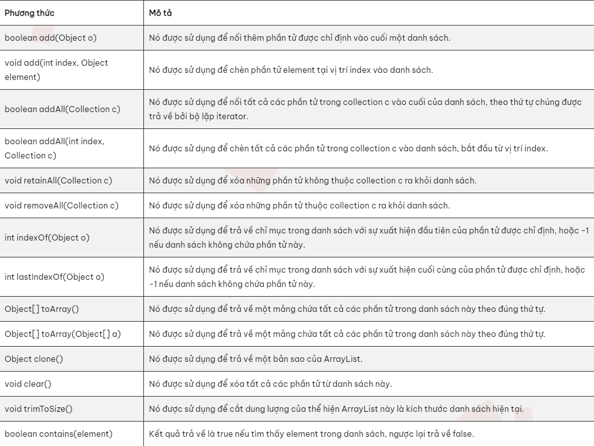
        - VD:
         ```java
         import java.util.ArrayList; // import the ArrayList class
         import java.util.Collections;

         public class Main {
             public static void main(String[] args) {
                 ArrayList<String> cars = new ArrayList<String>(); // Create an ArrayList object
                 cars.add("Volvo");
                 cars.add("BMW");
                 cars.add("Ford");
                 cars.add("Mazda");

                 // Có thể xuất tất cả tập hợp cars dưới dạng 1 String
                 System.out.println(cars);


                 // Sort trong ArrayList: Sử dụng phương thức sort của Collections:
                 Collections.sort(cars);  // Sort cars
                 // Duyệt:
                 for (String i : cars) {
                     System.out.println(i);
                 }

                 // Lấy 1 phần tử
                 cars.get(0);
                 // Set giá trị
                 cars.set(0, "Opel");
                 // Remove:
                 cars.remove(0);
                 // Xóa hết
                 cars.clear();
                 // Xuất ra size
                 cars.size();
             }
         }
         Output:
         [Volvo, BMW, Ford, Mazda]
         BMW
         Ford
         Mazda
         Volvo
         ```
   4. So sánh Vector và ArrayList :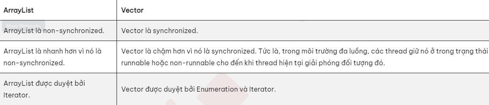
3. Set:
   1. ĐN: 
      - thuộc gói java.until và mở rộng từ Collection interface.
      - Nó là một tập hợp các đối tượng không có thứ tự trong đó các giá trị trùng lặp không thể được lưu trữ. 
      - Nó còn có 2 giao diện được mở rộng là: Sorted Set và Navigable Set: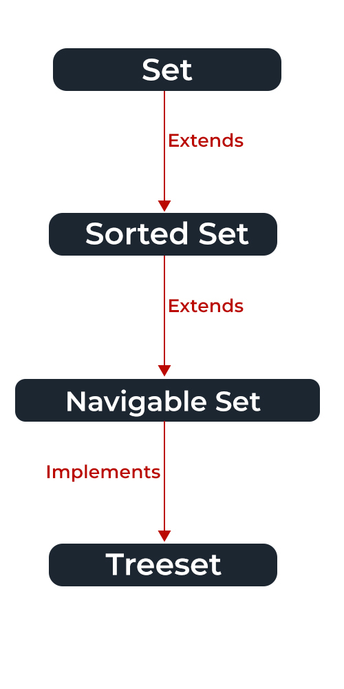
   2. Các phương thức:
      1. 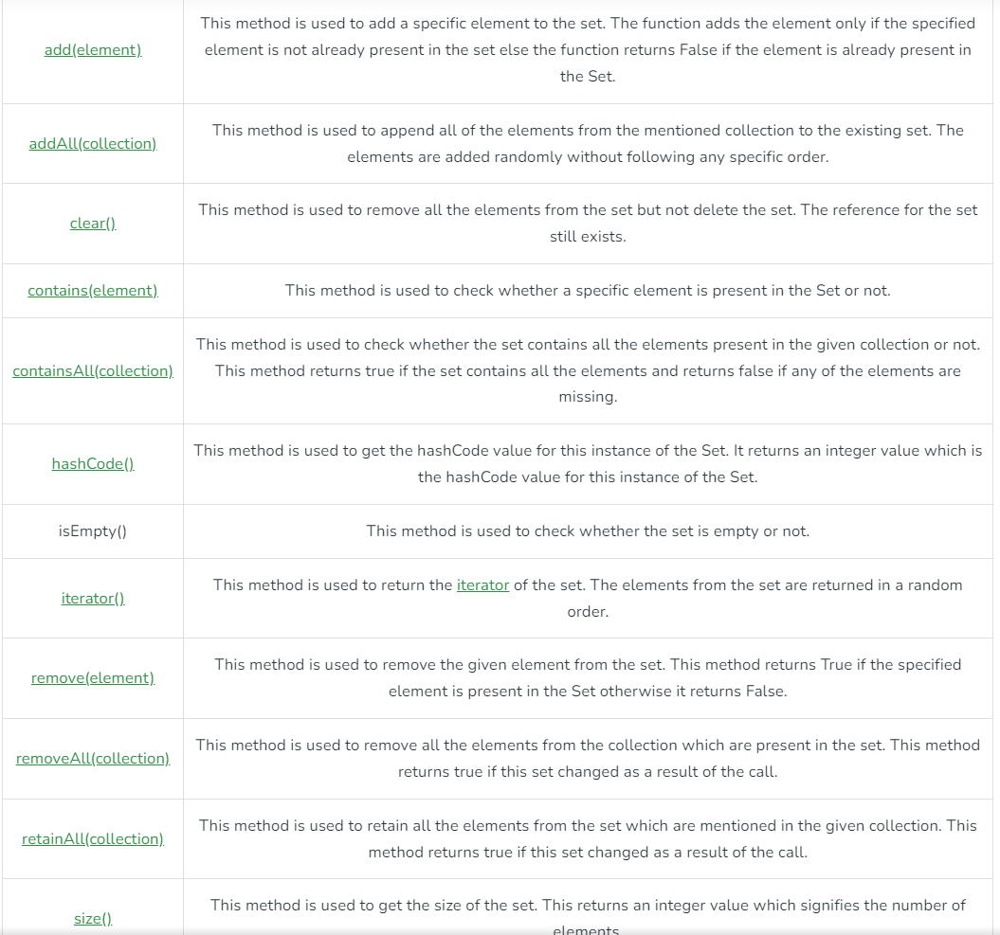  
   3. Ví dụ:
      1. // Lớp Hash Set nó sắp xếp luôn rồi :v
        ```java
        Set<String> set = new HashSet<String>();
        Set<String> set1 = new HashSet<String>();
        set.add("Chao");
        set.add("Cac");
        set.add("Ban");
        set.add("Nhe");
        set.add("Chao");

        System.out.println(set); //[Chao, Cac, Nhe, Ban]

        set1.add("CHAO");
        set1.add("CAC");
        set1.add("BAN");
        set1.add("NHE");
        set1.add("CHAO");

        set.addAll(set1);

        System.out.println(set); //[Chao, Cac, CAC, Nhe, NHE, CHAO, Ban, BAN]
        ```
       2. 
        ```java
        import java.util.HashSet;
        import java.util.Set;

        public class Main {
            public static void main(String[] args) {
                Set<Integer> set = new HashSet<Integer>();
                Set<Integer> set1 = new HashSet<Integer>();

                set1.add(1);
                set1.add(2);
                set1.add(3);
                set1.add(4);

                set.add(3);
                set.add(4);
                set.add(5);
                set.add(6);

                System.out.println(set);
                System.out.println(set1);
                System.out.println("----------------");
                // Hợp của 2 tập:
                Set<Integer> union = new HashSet<Integer>(set);
                union.addAll(set1);
                System.out.println(union);
                System.out.println("----------------");
                // Giao của 2 tập
                Set<Integer> intersection = new HashSet<Integer>(set);
                intersection.retainAll(set1); // giữ lại các phàn tử của cả 2 tập
                System.out.println(intersection);
                System.out.println("----------------");
                // Khác của 2 tập:
                Set<Integer> diferrence = new HashSet<Integer>();
                diferrence.removeAll(set1);
                System.out.println(diferrence);
            }
        }
        ```
    4. Sorted Set: Set nhưng có sắp xếp
    5. 1 số lớp của set: TreeSet, HashSet, LinkedHashSet,EnumSet
### 4: Interface Map, SortedMap -> HashMap, TreeMap.
1. Map Interface:
   1. ĐN:
      1. Là 1 Interface thuộc package java.util thể hiện sự liên quan giữa 1 key và 1 value.
      2. Ko phải 1 loại của Collection nên sẽ có khác 1 chút.
   2. Khi nào SD:
      1. Vì nó thể hiện sự liên hệ giữa key và value nên có thể sd để làm pass, ng dùng có thể thay đổi value(pass)
   3.  
   4. Khởi tạo:
      1. ``` Map<String, Integer> hm = new HashMap<String, Integer>(); ```
   5. Phương thức:
      1. 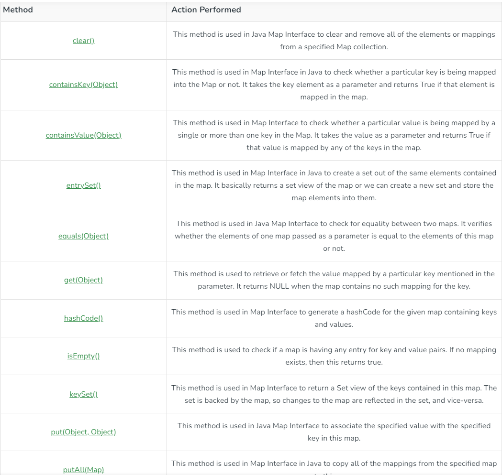
      2. 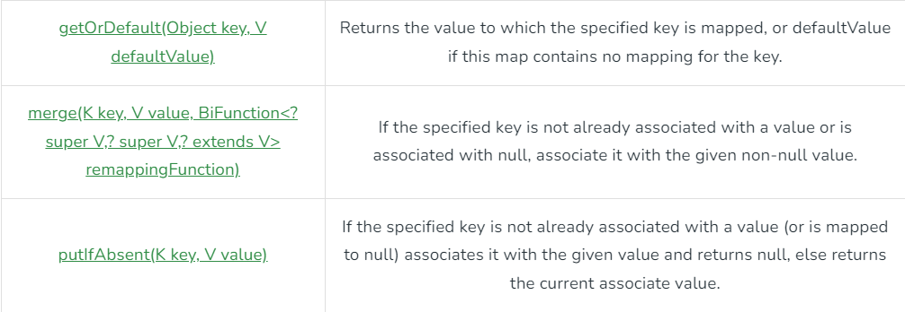
      3. VD: 
            ```java import java.util.HashMap;
            import java.util.Map;

            //TIP To <b>Run</b> code, press <shortcut actionId="Run"/> or
            // click the <icon src="AllIcons.Actions.Execute"/> icon in the gutter.
            public class Main {
                public static void main(String[] args) {
                    Map<String, Integer> hm = new HashMap<String, Integer>();

                    hm.put("key1",20);
                    hm.put("key2",20);
                    hm.put("key3",20);

                    hm.put("key1",80);
                    for(Map.Entry<String,Integer> m : hm.entrySet()){ // entrySet(): tạo 1 danh sách key
                        System.out.print(m.getKey() + ":");
                        System.out.println(m.getValue());
                    }
                }
            }```
2. HashMap:
   1.  Là 1 phần của Collection, cung cấp phg thức đơn giản implement của Map Interface
   2.  Để truy cập vào 1 Value, nó phải thông qua Key. Class này sử dụng 1 cộng nghệ : Hashing(Mã hóa 1 xâu lớn thành xây nhỏ đại diện) => Sẽ giúp việc chạy nhanh hơn
   3.  Lưu theo việc sắp xếp key
3.  Linked Map:
    1.  Tg tự hashmap nhưng lưu theo thứ tự nhập
    2.  VD: 
        1.  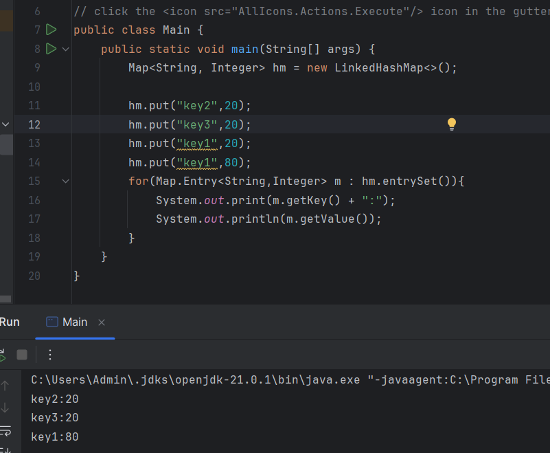
        2.  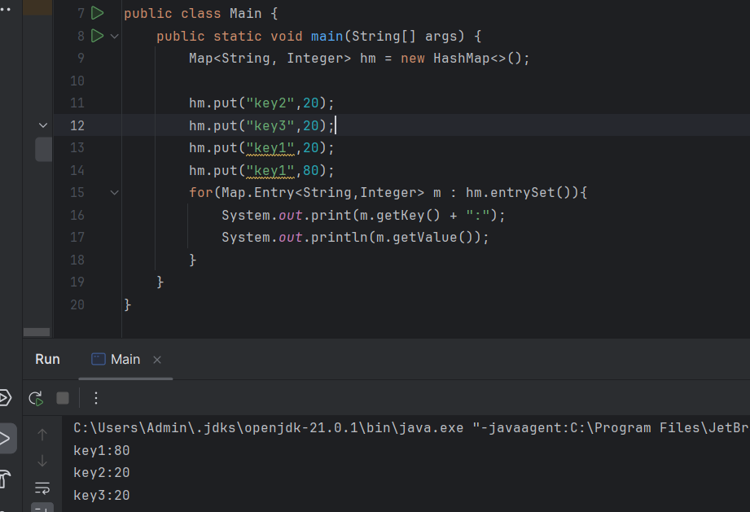
4.  Tree Map
    1.  ĐN: TreeMap trong Java được sử dụng để triển khai giao diện Map và NavigableMap cùng với Abstract Class. Map được sắp xếp **theo thứ tự tự nhiên của các Key** hoặc bởi **Bộ so sánh** được cung cấp tại thời điểm tạo bản đồ, **tùy thuộc vào trình tạo nào được sử dụng.** Điều này chứng tỏ là một cách hiệu quả để sắp xếp và lưu trữ các cặp key-value. Thứ tự lưu trữ được duy trì bởi Tree phải phù hợp với các bằng nhau giống như bất kỳ Map được sắp xếp nào khác, bất kể các so sánh rõ ràng. 
    2.  VD: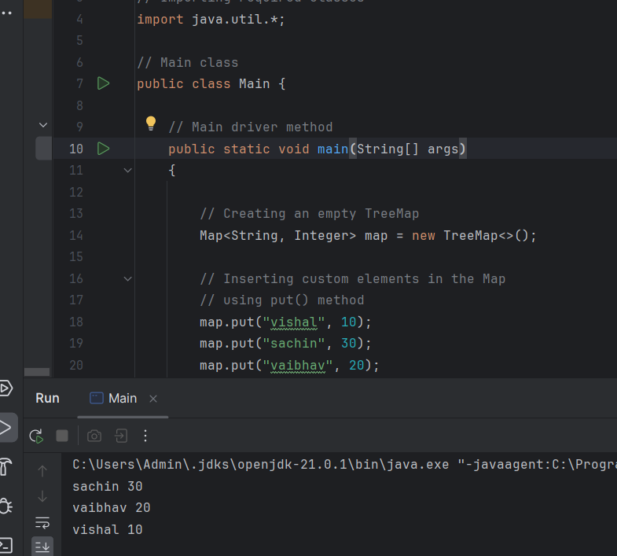


### 4. Tại sao có nhiều CTDL:

1. ĐN: Cấu trúc dữ liệu là một cách để tổ chức dữ liệu trong máy tính để có thể truy cập và xử lý hiệu quả. Có nhiều loại cấu trúc dữ liệu khác nhau, mỗi loại có những ưu điểm và nhược điểm riêng.

2. Các loại cấu trúc dữ liệu phổ biến trong Java bao gồm:

   - Mảng: Mảng là một cấu trúc dữ liệu tuyến tính, trong đó dữ liệu được lưu trữ theo thứ tự liên tiếp.
   - Danh sách liên kết: Danh sách liên kết là một cấu trúc dữ liệu không tuyến tính, trong đó dữ liệu được lưu trữ dưới dạng một chuỗi các nút liên kết với nhau.
   - Cây: Cây là một cấu trúc dữ liệu phân cấp, trong đó dữ liệu được tổ chức thành các cấp độ.
   - Bảng băm: Bảng băm là một cấu trúc dữ liệu nhanh chóng để truy cập dữ liệu theo khóa.
   - Map, Set,....
   - => Vì vậy, có nhiều cấu trúc dữ liệu vì mỗi loại có những ưu điểm và nhược điểm riêng. Việc lựa chọn cấu trúc dữ liệu phù hợp phụ thuộc vào loại dữ liệu cần lưu trữ và các thao tác cần thực hiện trên dữ liệu đó.

3. Cách sử dụng các cấu trúc dữ liệu

   - Cách sử dụng các cấu trúc dữ liệu trong Java khá đơn giản. Các cấu trúc dữ liệu được cung cấp sẵn trong thư viện chuẩn của Java. Để sử dụng một cấu trúc dữ liệu, bạn cần tạo một đối tượng của cấu trúc dữ liệu đó. Sau đó, bạn có thể sử dụng các phương thức của đối tượng đó để thêm, xóa, truy cập dữ liệu trong cấu trúc.

4. Ví dụ:
    ```java
    Java
    // Tạo một mảng
    int[] numbers = new int[10];

    // Thêm dữ liệu vào mảng
    numbers[0] = 1;
    numbers[1] = 2;
    ...
    numbers[9] = 10;

    // Truy cập dữ liệu trong mảng
    int number = numbers[5];

    // Xóa dữ liệu trong mảng
    numbers[5] = 0;
    ```

5. Dưới đây là một số ví dụ về cách sử dụng các cấu trúc dữ liệu trong Java:

    - Mảng: Mảng thường được sử dụng để lưu trữ một tập hợp dữ liệu có kích thước cố định. Ví dụ, bạn có thể sử dụng mảng để lưu trữ danh sách điểm số của học sinh, danh sách sản phẩm trong một cửa hàng hoặc danh sách các số nguyên.
    Danh sách liên kết: Danh sách liên kết thường được sử dụng để lưu trữ một tập hợp dữ liệu có kích thước thay đổi. Ví dụ, bạn có thể sử dụng danh sách liên kết để lưu trữ danh sách liên hệ, danh sách lịch sử giao dịch hoặc danh sách các mục trong một danh sách việc cần làm.
    - Cây: Cây thường được sử dụng để lưu trữ một tập hợp dữ liệu có mối quan hệ phân cấp. Ví dụ, bạn có thể sử dụng cây để lưu trữ danh sách thư mục và tệp, danh sách sản phẩm và danh mục hoặc danh sách các thành viên trong một tổ chức.
    Bảng băm: Bảng băm thường được sử dụng để lưu trữ một tập hợp dữ liệu có kích thước lớn. Ví dụ, bạn có thể sử dụng bảng băm để lưu trữ danh sách tên người dùng và mật khẩu, danh sách các địa chỉ IP hoặc danh sách các sản phẩm được bán trong một cửa hàng.
    Kiến thức về cấu trúc dữ liệu là một trong những kiến thức nền tảng quan trọng nhất đối với bất kỳ lập trình viên nào. Việc hiểu và sử dụng các cấu trúc dữ liệu một cách hiệu quả sẽ giúp bạn viết ra các chương trình máy tính hiệu suất và hiệu quả hơn.

