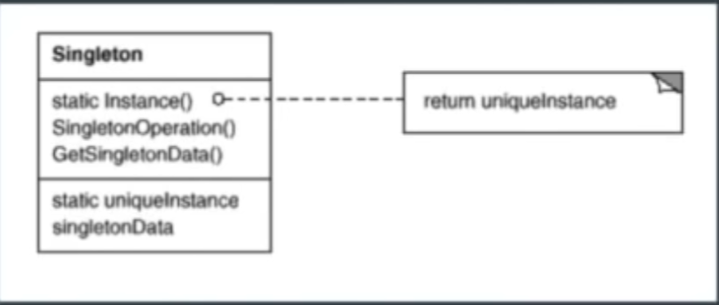
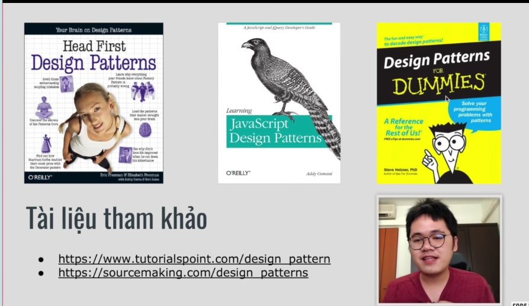

# Nhập môn Design Pattern
## 1. ĐN:
1.  Là mẫu(pattern) để giải quyết vấn đề hay gặp
2.  Giúp tổ chức code tốt hơn, dùng cho all ngôn ngữ
3.  Dễ để trao đổi, bàn bạc.
4.  Là những thiết kế do ng đi trước vẽ ra để xly cho từng công việc.(code như nào, uml sao,....)

## 2. Ng gốc:
1. Sách Gang of Four có tầm 22 design pattern
2. Hay dùng trong OOP
3. 3 loại: Creational(tạo Object), Structural, Behavioural(Các liên hệ các Object)
4. Các Design Pattern hay dùng: Factory, Fecade,Singleton, Observer
    - VD: 
## 3.Cách học:
1. Xem Context(vấn đề), UML(Thiết kế class), Code Example
2. Phải nhớ pattern để giải quyết vấn đề j
3. Học và tìm hiểu về pattern trong Framework
4. Áp dụng vào thực tế (VD: NPC thì sdung design button j)
   
## 4. Áp dụng Design Pattern:
1. Đừng lam dụng
2. Học và tìm hiểu về tưng pattern

// Tham khảo: https://toidicodedao.com/2016/03/01/nhap-mon-design-pattern-phong-cach-kiem-hiep/
// https://toidicodedao.com/2015/03/24/solid-la-gi-ap-dung-cac-nguyen-ly-solid-de-tro-thanh-lap-trinh-vien-code-cung/

