[JAVA] - BUỔI 9: LUÔN CÓ NGOẠI LỆ, XỬ LÍ NGOẠI LỆ

# I. Try - Catch:

## 1. Làm quen với Exception: Checked và Unchecked Exception, Error

### 1. Các định nghĩa :
#### 1. Ngoại lệ là gì: 
##### 1. ĐN: 
- Trong Java, Ngoại lệ là một sự kiện không mong muốn hoặc không mong muốn, xảy ra trong quá trình thực thi chương trình, tức là tại thời điểm chạy, *nó làm gián đoạn luồng bình thường của các lệnh của chương trình*. Các trường hợp ngoại lệ có thể được chương trình bắt và xử lý. 
- Khi một ngoại lệ xảy ra trong một phương thức, nó sẽ **tạo ra một đối tượng**. Đối tượng này được gọi là **đối tượng ngoại lệ**. Nó chứa thông tin về ngoại lệ, chẳng hạn như tên và mô tả ngoại lệ và trạng thái của chương trình khi ngoại lệ xảy ra.
     - VD: khi ta muốn nhập 1 số nguyên n nhưng nhập nhầm ký tự: 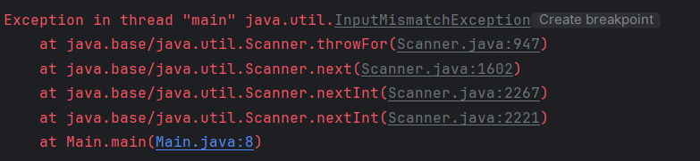
##### 2 Những lý do chính gây ngoại lệ: 
   - Đầu vào của người dùng không hợp lệ
   - Lỗi thiết bị
   - Mất kết nối mạng
   - Giới hạn vật lý (bộ nhớ ngoài đĩa)
   - Lỗi code
   - Mở tệp không khả dụng
##### 3. So sánh **lỗi (Error)** và **ngoại lệ**:
   - **Lỗi** : đại diện cho các điều kiện không thể khôi phục như máy ảo Java (JVM) hết bộ nhớ, rò rỉ bộ nhớ, lỗi tràn ngăn xếp, không tương thích thư viện, đệ quy vô hạn, v.v. Lỗi thường nằm ngoài tầm kiểm soát của lập trình viên và chúng ta không nên cố gắng xử lý lỗi.
   - **Ngoại lệ**: Ngoại lệ chỉ ra các điều kiện mà một ứng dụng hợp lý có thể cố gắng nắm bắt.

##### 4. Hệ thống phân cấp của lỗi và ngoại lệ:
1. Tất cả các loại ngoại lệ và lỗi là các lớp con của lớp **Throwable**, là lớp cơ sở của hệ thống phân cấp.
   1. Nhánh 1: Quản lý bởi Exception mà ng viết chtr nên nắm bắt. (VD: NullPointerException là một ví dụ về ngoại lệ như vậy.)
   2. Nhánh 2: Lỗi được sử dụng bởi hệ thống thời gian chạy Java (JVM) để chỉ ra các lỗi liên quan đến chính môi trường thời gian chạy (JRE). (VD: StackOverflowError là một ví dụ về lỗi như vậy.)
2. 

##### 5. Các loại ngoại lệ: (theo 2 cách) 

###### 1. Ngoại lệ tích hợp (Built-in Exception):
1. ĐN: Ngoại lệ tích hợp là các ngoại lệ có sẵn trong các thư viện Java. Những ngoại lệ này phù hợp để giải thích các tình huống lỗi nhất định.
2. **Checked Exception**: Các Checked Exception được gọi là ngoại lệ thời gian biên dịch vì các ngoại lệ này được ***trình biên dịch kiểm tra tại thời điểm biên dịch.***. Người dùng **bắt buộc phải build code xử lý ngoại lệ**, nếu ko thì sẽ **không cho chạy chg trình**.
   1. VD: FileNotFound
3. **Unchecked Exception**: 
   1. ĐN : Đây là những trường hợp ngoại lệ **không được kiểm tra tại thời điểm biên dịch**. Trong C++, tất cả các ngoại lệ đều không được chọn, vì vậy trình biên dịch không buộc phải xử lý hoặc chỉ định ngoại lệ. Tùy thuộc vào các lập trình viên phải văn minh và chỉ định hoặc nắm bắt các trường hợp ngoại lệ. 
   2. ***(Ý là: Java có cho chạy chương trình, nhưng lỗi có thể xảy ra khi đang chạy)***. VD: chia cho 0 
   3. Trong Java, các ngoại lệ trong các lớp Error và RuntimeException là các ngoại lệ không được chọn, mọi thứ khác trong throwable đều được kiểm tra.
   4. VD: Hãy xem xét chương trình Java sau đây. Nó biên dịch được, nhưng nó ném *ArithmeticException* khi chạy. Trình biên dịch **cho phép nó biên dịch** vì *ArithmeticException* là một ngoại lệ không được chọn.
      - 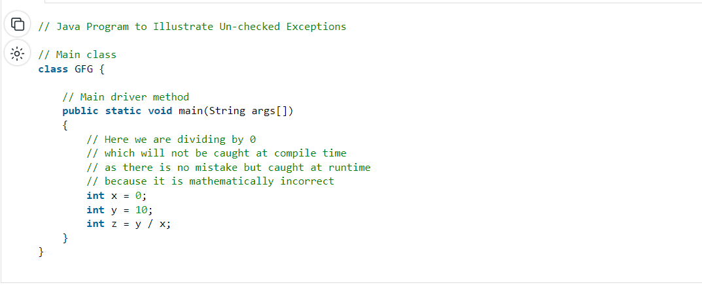
      - 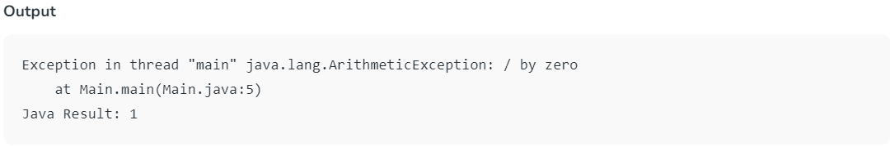 // ???
   5. Nói tóm lại, các ngoại lệ không được kiểm soát là các ngoại lệ thời gian chạy không bắt buộc phải bị bắt hoặc khai báo trong mệnh đề ném. Những ngoại lệ này thường được gây ra bởi các lỗi lập trình, chẳng hạn như cố gắng truy cập một chỉ mục ngoài giới hạn trong một mảng hoặc cố gắng chia cho không.Các ngoại lệ không được chọn bao gồm tất cả các lớp con của lớp RuntimeException, cũng như lớp Error và các lớp con của nó.
      1. Dưới đây là một số ví dụ về các ngoại lệ không được kiểm tra trong Java:
         1. ArrayIndexOutOfBoundsException: Ngoại lệ này được đưa ra khi bạn cố gắng truy cập vào một chỉ mục mảng nằm ngoài giới hạn.
         2. NullPointerException: Ngoại lệ này được ném khi bạn cố gắng truy cập tham chiếu đối tượng null.
         3. ArithmeticException: Ngoại lệ này được đưa ra khi bạn cố gắng chia cho 0 hoặc thực hiện một phép toán số học không hợp lệ.
###### 2. Ngoại lệ do ng dùng xác định (Use Defined Exception):
- Đôi khi, các ngoại lệ tích hợp trong Java không thể mô tả một tình huống nhất định. Trong những trường hợp như vậy, người dùng cũng có thể tạo ngoại lệ, được gọi là 'Ngoại lệ do người dùng xác định'.
1. Ưu điểm của Exception Handling trong Java như sau:
   1. Cung cấp để hoàn thành việc thực hiện chương trình
   2. Dễ dàng xác định mã chương trình và mã xử lý lỗi
   3. Tuyên truyền lỗi (Propagation of Errors ???)
   4. Báo cáo lỗi có ý nghĩa
   5. Xác định các loại lỗi
2. In các ngoại lệ: 
   1. **printStackTrace()**: Phương pháp này in thông tin ngoại lệ theo định dạng Tên của ngoại lệ: mô tả ngoại lệ, dấu vết stack trace..
      1. 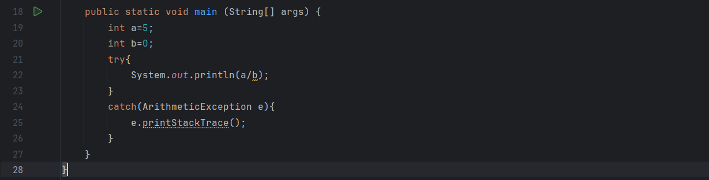
      2. 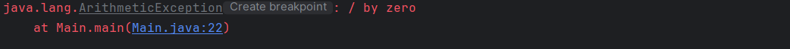
   2. **toString()** : Phương thức toString() in thông tin ngoại lệ theo định dạng Tên của ngoại lệ: mô tả ngoại lệ.
      1. 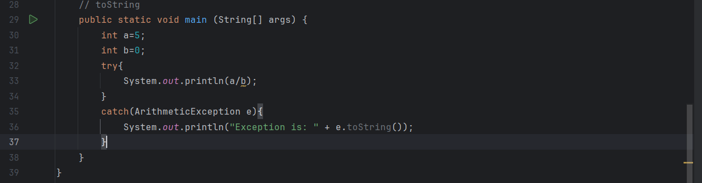
      2. 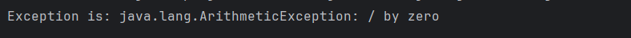
   3. **getMessage()**: Phương thức getMessage() chỉ in mô tả ngoại lệ.
      1. 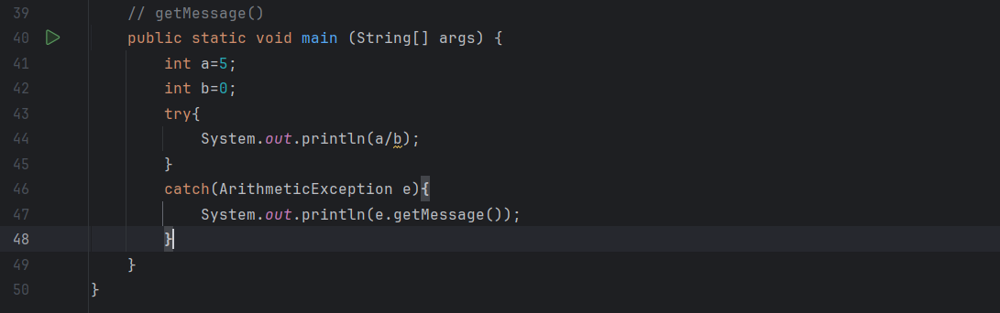
      2. 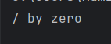
#### 2. **Xử lý ngoại lệ trong Java**: 
1. ĐN : là một trong những phương tiện hiệu quả để xử lý các lỗi thời gian chạy để luồng của ứng dụng có thể được duy trì chạy. Java Exception Handling là cơ chế xử lý các lỗi thời gian chạy như ClassNotFoundException, IOException, SQLException, RemoteException,... 

##### 1. JVM xử lý ngoại lệ ntn? (Xử lý ngoại lệ mặc định):
1. **Xử lý ngoại lệ mặc định**: 
   1. 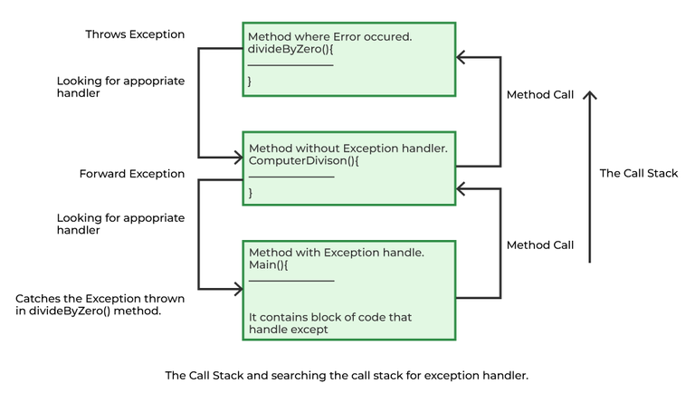
   2. Bất cứ khi nào bên trong một phương thức, nếu một ngoại lệ đã xảy ra, phương thức sẽ **tạo ra một Đối tượng** được gọi là **Đối tượng ngoại lệ** và **chuyển nó cho hệ thống thời gian chạy (JVM)**. Đối tượng ngoại lệ chứa tên và mô tả ngoại lệ và trạng thái hiện tại của chương trình nơi ngoại lệ đã xảy ra. **Tạo Exception Object và xử lý nó trong hệ thống run-time** được gọi là *throwing* một Exception. Có thể có một danh sách các phương thức đã được gọi để đến phương thức xảy ra ngoại lệ. Danh sách các phương thức được sắp xếp theo thứ tự này được gọi là **Call Stack**. Bây giờ thủ tục sau đây sẽ xảy ra: 
      1. Hệ thống run-time sẽ chạy cái call stack để tìm cái phương thức chứa khối code có thể xử lý ngoại lệ. Khối của mã được gọi là **Exception Handler**.
      2. Hệ thống thời gian chạy bắt đầu **tìm kiếm từ phương thức trong đó ngoại lệ xảy ra** và tiến hành thông qua call stack theo thứ tự ngược lại trong đó các phương thức được gọi.
      3. Nếu nó **tìm thấy một trình xử lý thích hợp**, thì nó sẽ **vượt qua ngoại lệ xảy ra cho nó**. Trình xử lý thích hợp có nghĩa là loại đối tượng ngoại lệ được ném phù hợp với loại đối tượng ngoại lệ mà nó có thể xử lý.
      4. **Nếu** hệ thống thời gian chạy tìm kiếm tất cả các phương thức trên ngăn xếp cuộc gọi và **không thể tìm thấy trình xử lý thích hợp**, thì *hệ thống thời gian chạy* sẽ **chuyển giao Đối tượng ngoại lệ cho trình xử lý ngoại lệ mặc định**, là một phần của hệ thống thời gian chạy. Trình xử lý này in thông tin ngoại lệ theo định dạng sau và chấm dứt chương trình bất thường.
##### 2. Lập trình viên xử lý ngoại lệ như thế nào?:
###### 1. Customized Exception Handling: 
   1. Quản lý dựa trên 5 từ khóa : Try - catch - throw - throws - finally.
   2. Các câu lệnh chương trình mà bạn nghĩ có thể đưa ra ngoại lệ được chứa trong một khối thử **(Try)**. Nếu một ngoại lệ xảy ra trong khối thử, nó sẽ được ném. Mã của bạn có thể bắt ngoại lệ này (sử dụng **catch**) và xử lý nó theo một cách hợp lý. *Các ngoại lệ do hệ thống tạo ra được hệ thống thời gian chạy Java tự động ném*. Để ném ngoại lệ theo cách thủ công, hãy sử dụng keyword throw. **Bất kỳ ngoại lệ nào ném ra khỏi một phương thức phải được chỉ định như vậy bởi một mệnh đề ném**. Bất kỳ mã nào hoàn toàn **phải được thực thi sau khi Try hoàn thành** được đặt trong một khối cuối cùng.
###### 2. VD sử dụng Try - Catch :
   - VD : Code: 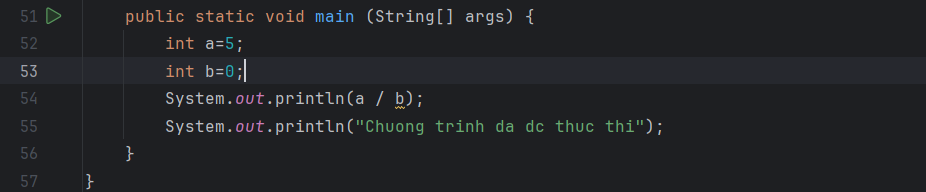
   - Output : 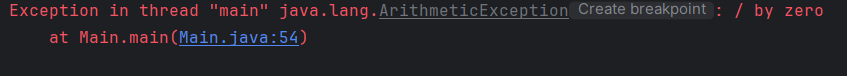  
   - Ta thấy: khi gặp a/b, b = 0, chg trình sẽ ném ra 1 ngoại lệ. Trong trường hợp này, JVM chấm dứt chương trình bất thường. Câu lệnh **System.out.println("Chuong trinh da dc thuc thi")**; sẽ không bao giờ thực hiện. Để thực hiện nó, chúng ta phải xử lý ngoại lệ bằng cách sử dụng try-catch. Do đó, để tiếp tục dòng chảy bình thường của chương trình, chúng ta cần một try-catch
   - Code : 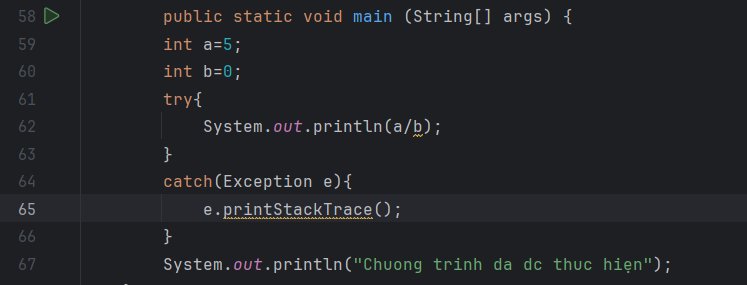
   - 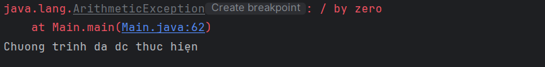
   - => Chương trình đã đc thực hiện đủ
###### 3. Tự tạo ngoại lệ:
   1. Lợi ích : 
      - Sự tùy chỉnh.
   2. Lưu ý:
      1. Muốn ngoại lệ là Checked thì kế thừa từ lớp Exception, Unchecked thì kế thừa từ lớp Runtime Exception
   3. VD:
      1. 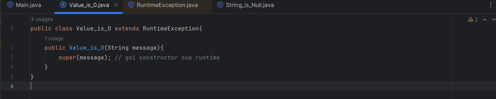
      2. 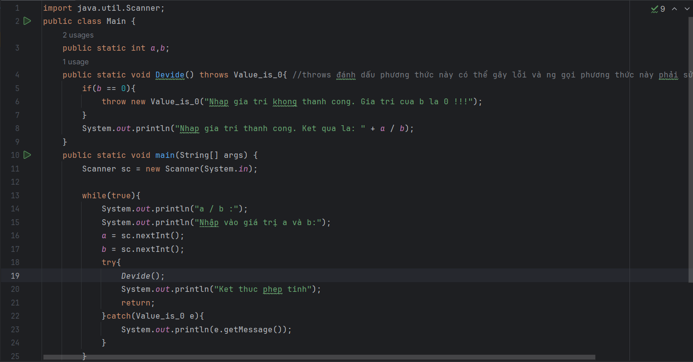
      3. 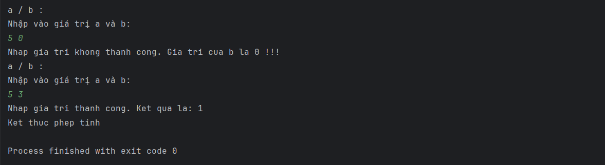
#### 3. Cấu trúc Try - Catch - Finally
1. Cấu trúc :
```java
try {
    // block of code to monitor for errors
    // the code you think can raise an exception
} catch (ExceptionType1 exOb) {
    // exception handler for ExceptionType1
} catch (ExceptionType2 exOb) {
    // exception handler for ExceptionType2
}
// optional
finally {  // block of code to be executed after try block ends 
}
```
1. Một số điểm chính cần được ghi nhớ như sau:   
   1. Trong một phương thức, có thể có **nhiều hơn một câu lệnh có thể đưa ra một ngoại lệ**, Vì vậy, hãy đặt tất cả các câu lệnh này trong **Try** của riêng chúng và **cung cấp một trình xử lý ngoại lệ riêng biệt** trong khối bắt riêng của chúng cho mỗi câu lệnh.
   2. Nếu một ngoại lệ xảy ra trong khối thử, ngoại lệ đó được xử lý bởi trình xử lý ngoại lệ được liên kết với nó. **Để liên kết trình xử lý ngoại lệ**, chúng ta phải đặt một khối bắt (**Catch**) sau nó. Có thể có nhiều hơn một trình xử lý ngoại lệ. *Mỗi khối catch là một trình xử lý ngoại lệ xử lý ngoại lệ cho loại được chỉ định bởi đối số của nó*. Đối số, ExceptionType khai báo loại ngoại lệ mà nó có thể xử lý và phải là tên của lớp kế thừa từ lớp Throwable.
   3. Đối với mỗi khối Try, có thể không có hoặc nhiều khối Catch, nhưng chỉ có một khối Finally.
   4. **Khối Finally là tùy chọn. Nó luôn được thực thi cho dù một ngoại lệ xảy ra trong khối thử hay không**. Nếu một ngoại lệ xảy ra, thì nó sẽ được thực thi sau khi thử và bắt các khối. Và nếu một ngoại lệ không xảy ra, thì nó sẽ được thực thi sau khối thử. *Khối Finally trong Java được sử dụng để đặt các mã code quan trọng như mã dọn dẹp, ví dụ: đóng tệp hoặc đóng kết nối.*
   5. Nếu chúng ta viết System.exit trong khối try, thì cuối cùng khối sẽ không được thực thi.
2. 1 số lưu ý khi ném ng lệ:
   1. Ko để cho java ném ngoại lệ trước.
   2. tự tạo đối tượng để ném
   3. tự ném ng lệ
#### 4. Phân biệt throw và throws
1. throw:
   1. ĐN: được sử dụng để tạo ra 1 ngoại lệ cụ thể và đẩy nó ra khỏi phương thức hiện tại.
   2. Code: ```thown + đối tượng ngoại lệ muốn ném```
      1. VD1: 
         1. 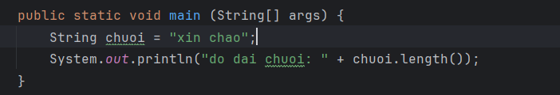
         2. out: 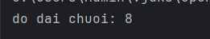
      2. VD2: 
         1. 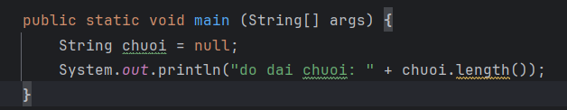
         2. out: 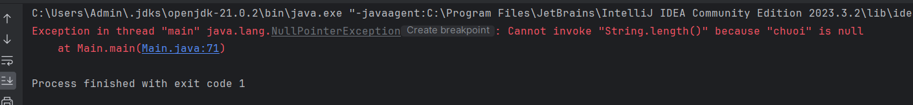
         3. Trên đây là thông báo lỗi mà java tự tạo ra.
      3. VD3: tự tạo ném ng lệ:
         1. 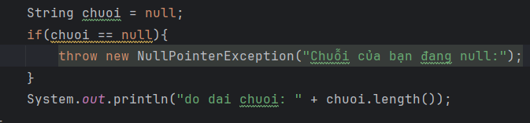
         2. 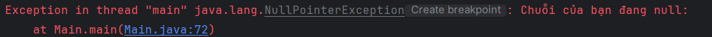
   3. Vai trò: giúp ta ném những ngoại lệ mà ta tự tạo ra
      1. VD: 
         1. 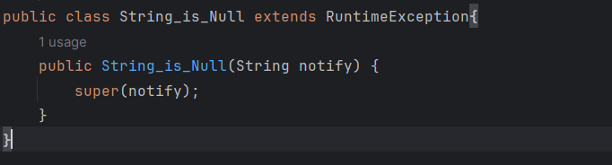
         2. 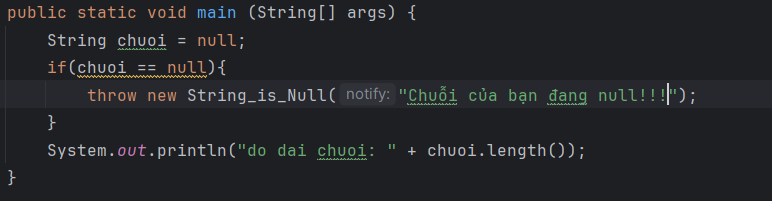
         3. out: 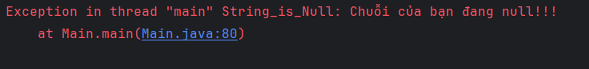
2. throws 
   1. ĐN : là một từ khóa trong Java được sử dụng đánh dấu một phương thức để chỉ ra rằng **phương thức này có thể ném một trong các ngoại lệ** kiểu được liệt kê. Người gọi đến các phương thức này phải xử lý ngoại lệ bằng cách sử dụng khối try-catch.
   2. trong VD trên, ta sửa 1 chút:
      1. 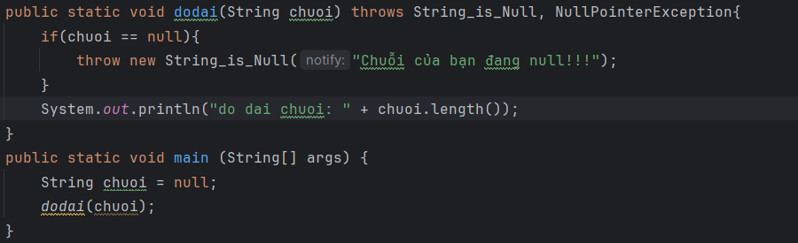
      2. 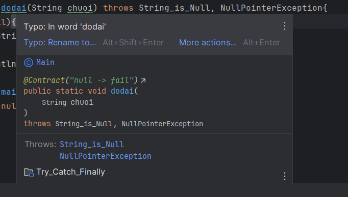 => Chg trình sẽ cho ta biết phương thức được throws có thể sinh ra những lỗi nào.
   3. Vai trò: 
      1. giúp ta chuẩn bị trước các cách để sửa lỗi.
      2. Đánh dấu để khi ta hoặc ai đó gọi đến phương thức, ta phải sửa lỗi đó (thường sử dụng với Checked Exception) 
         1. VD: 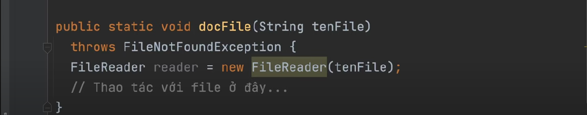
         2.  ta đánh dấu throws để biết phương thức docfile có thể gây ngoại lệ FIleNotFound, và **ai đó gọi phương thưc docFile phải xử lý cái lỗi đó** (có thể bằng try - catch hoặc tiếp tục lờ đi, đánh dấu để sau sửa (ducking exception :) )).